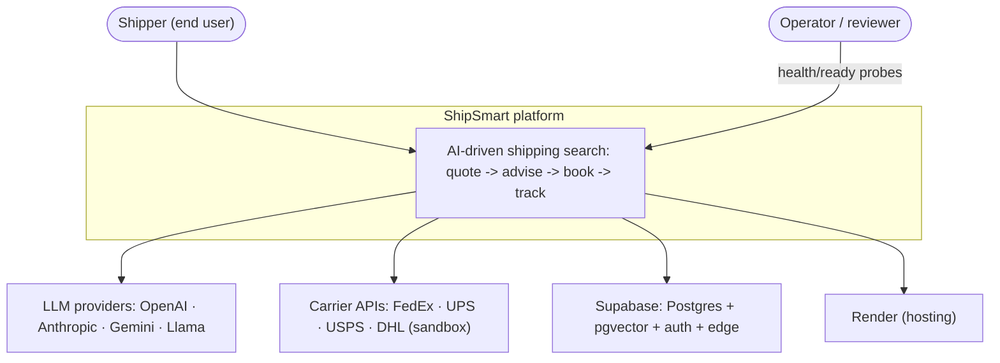
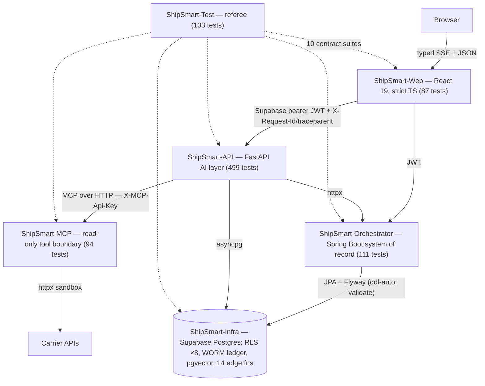
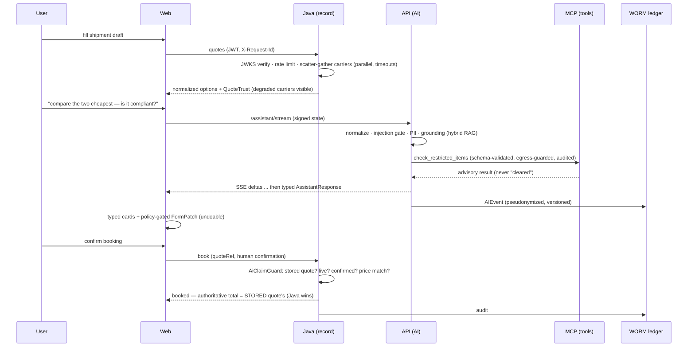
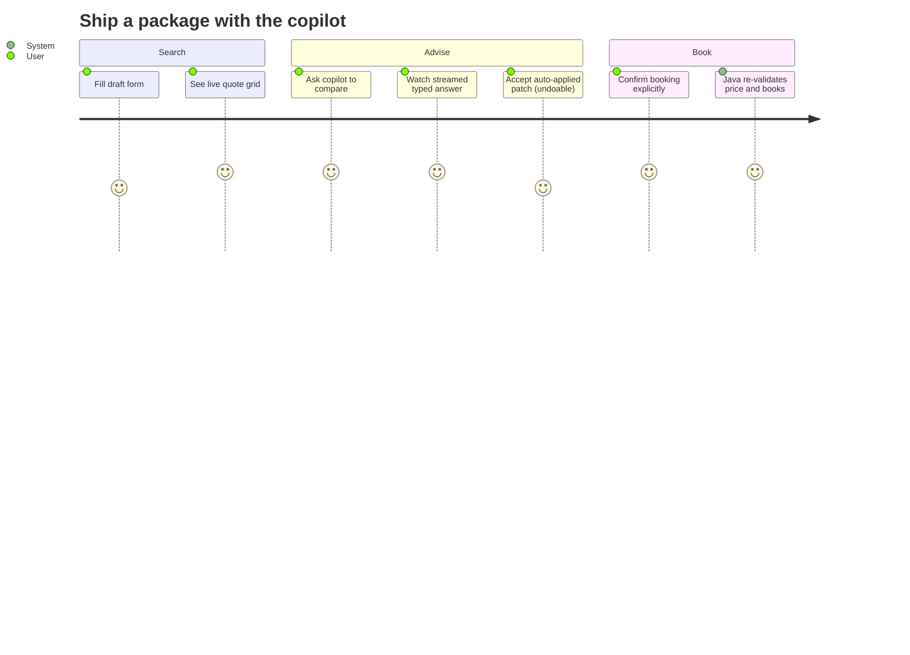
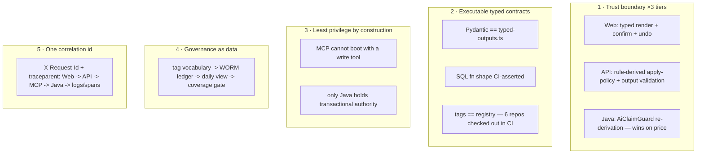
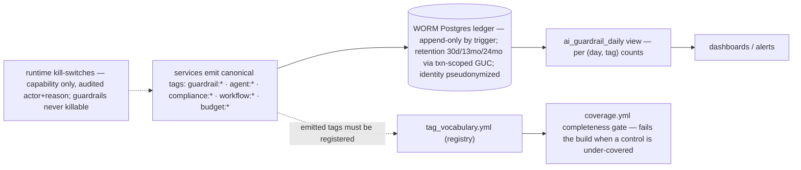
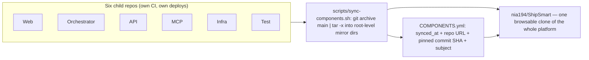
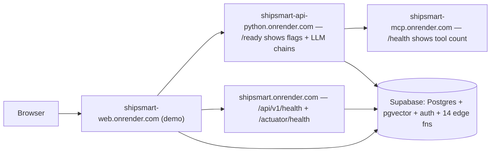
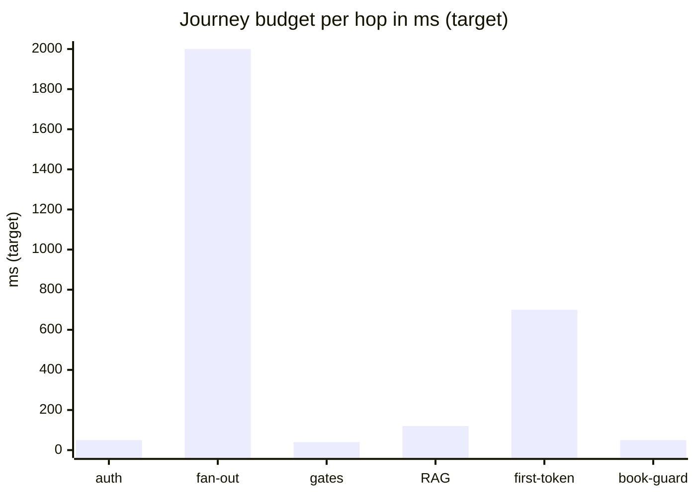
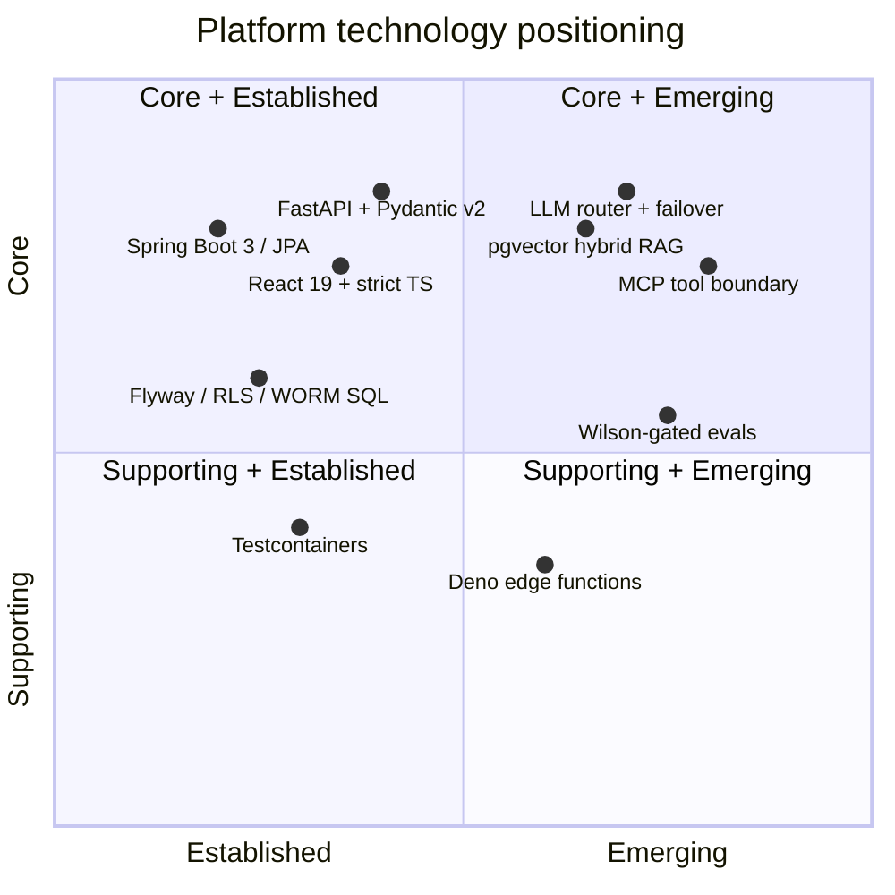

# ShipSmart

[](#components)
[](#cross-cutting-engineering)
[](#the-live-system)
[](#cross-cutting-engineering)
[](./LICENSE)

**A shipping search and comparison platform with an AI copilot** — compare real
carrier quotes, get grounded shipping advice with citations, fill the shipment
form by chatting (with policy-gated, undoable patches), stream answers token by
token, run compliance checks, and route risky cases through a human-reviewable
multi-agent workflow. Built as **six focused services** that develop and deploy
independently and are verified together by a cross-repo contract + evaluation
harness.

**One thesis runs through every tier: the model advises, the system decides.**
The React UI renders *typed* AI output (never parsed prose); the Python AI layer
validates every model output against a schema and derives apply-policy from
rules; the Java system of record re-derives every AI-assisted booking from
stored state — **Java wins on price**. An LLM can direct attention here; it can
never book, clear, or price.

This repository is the **system view**: a read-only aggregate of the six
component repositories. Active development happens in the component repos; every
mirror directory below equals its repo's `main` at the exact commit recorded in
[`COMPONENTS.yml`](./COMPONENTS.yml).

> **Metric convention:** structural counts are facts verified against source;
> latency/availability figures are **(target)** budgets, never measured
> production metrics.

---

## Table of contents

- [The live system](#the-live-system)
- [What the product does](#what-the-product-does)
- [System context (C4 L1)](#system-context-c4-l1)
- [The mesh (C4 L2)](#the-mesh-c4-l2)
- [A request's life](#a-requests-life)
- [The architectural spine](#the-architectural-spine)
- [Components](#components)
- [Cross-cutting engineering](#cross-cutting-engineering)
- [AI governance](#ai-governance)
- [Repository model](#repository-model)
- [Deployment topology](#deployment-topology)
- [Platform SLOs & latency budget](#platform-slos--latency-budget)
- [Technology radar](#technology-radar)
- [Running the system](#running-the-system)
- [License](#license)

---

## The live system

| Service | URL | Public probe |
|---|---|---|
| **Web — the demo** | **[shipsmart-web.onrender.com](https://shipsmart-web.onrender.com)** | the app itself |
| Orchestrator (Java) | [shipsmart.onrender.com](https://shipsmart.onrender.com) | [`/api/v1/health`](https://shipsmart.onrender.com/api/v1/health) · [`/actuator/health`](https://shipsmart.onrender.com/actuator/health) |
| API (Python AI) | [shipsmart-api-python.onrender.com](https://shipsmart-api-python.onrender.com) | [`/ready`](https://shipsmart-api-python.onrender.com/ready) — resolved flags + LLM chains |
| MCP (tools) | [shipsmart-mcp.onrender.com](https://shipsmart-mcp.onrender.com) | [`/health`](https://shipsmart-mcp.onrender.com/health) — tool count |

*Render free tier: the first request may take ~30–60 s to wake a service.
Production surfaces are deliberately locked down — Swagger returns 401, `/docs`
is dev-only, error responses carry no stack traces.*

## What the product does

| Capability | How |
|---|---|
| **Quote search & comparison** | Submit a shipment, get carrier quotes (real FedEx Rate API, sandbox by default, behind one `QuoteProvider` seam), fanned out **in parallel** and compared with scored ranking — each quote carrying **trust metadata** (live/estimated/mock/cached) so degraded carriers are visible, never silent. |
| **Grounded shipping advisor** | Shipment-scoped Q&A over a curated corpus with citations and **explicit refusal** when the corpus can't support an answer — hybrid retrieval (pgvector dense + Postgres lexical) with a bounded iterative loop. |
| **Conversational concierge** | Multi-turn chat that fills the shipment form: extracted slots become **typed `FormPatch`es** that auto-apply, require confirmation, or never apply — with **single-level Undo**, per-field "from chat" provenance, and conflict surfacing. |
| **Streaming answers** | `POST /assistant/stream` emits SSE token deltas and closes with a **typed envelope** the UI renders as structured cards. |
| **Booking hand-off** | Idempotent booking redirect validated by **`AiClaimGuard`**: stored live quote required, explicit human confirmation required, and the authoritative total is always the stored quote's. |
| **Compliance checks** | Restricted/prohibited-item verdicts over the same corpus — **advisory-only**: "uncovered ⇒ unverified," never a fabricated clearance. |
| **Multi-agent workflow** | A checkpointed run through specialist agents (classification, documentation, landed cost, routing over a deterministic domain core) that **suspends for a human reviewer** on unverified high-risk areas. |
| **MCP tools** | Six read/preview tools over MCP/HTTP — the registry is **read-only by a boot-time invariant** (a write tool prevents startup). |

---

## System context (C4 L1)

**Figure 1 — ShipSmart and its world.**



---

## The mesh (C4 L2)

**Figure 2 — six services + umbrella, with protocols.** The Test tier's dashed
edges are *executable assertions*: its CI checks out all six repos and fails
when any two drift.



**Ownership rules the system is built on:**

- **Java is the single writer.** Every transactional fact is created and
  validated by the Orchestrator; the AI layer reads through it and never
  touches the database's money-truths.
- **Deterministic decisions, generative explanations.** Scoring, ranking,
  compliance verdicts, landed-cost math, and routing are code; the LLM extracts
  fuzzy intent and writes concise explanations.
- **The AI boundary is one funnel.** Prompt assembly, injection detection,
  untrusted-data fencing, PII redaction, HMAC state integrity, grounding/
  refusal, and decision-tag tracing live in a single guardrail choke point.
- **Tools are contained by construction.** Model-initiated actions execute only
  through the MCP server's schema-validated, SSRF-guarded, **read-only** tool
  registry — enforced at boot, audited per call.
- **Graceful degradation everywhere.** LLM failover chains ending in a keyless
  echo; carrier fallbacks; trust-tagged partial results; feature flags and
  runtime kill-switches (capability only — guardrails are never killable).

---

## A request's life

**Figure 3 — quote → advise → book, one request id throughout.**



**Figure 4 — the same path as a user journey.**



**Failure-path notes (coded behaviors):** an LLM provider outage fails over
along the chain (before the first streamed token) or degrades to the
deterministic echo; a carrier outage yields a trust-tagged partial grid; a
forged/unsigned client state is treated as empty and any "approval" it carries
is rejected.

---

## The architectural spine

**Figure 5 — five ideas, enforced everywhere.**



---

## Components

| Directory | Repository | Role | Stack | Tests |
|---|---|---|---|---|
| [`ShipSmart-Web/`](./ShipSmart-Web) | [repo](https://github.com/nia194/ShipSmart-Web) | Search-first SPA — typed AI rendering, SSE client, undoable patches, grid action bus | React 19 · Vite 5 · TS 5.9 strict · TanStack Query | **87** |
| [`ShipSmart-Orchestrator/`](./ShipSmart-Orchestrator) | [repo](https://github.com/nia194/ShipSmart-Orchestrator) | System of record — JWKS auth, scatter-gather quoting, AiClaimGuard, idempotency, optimistic locking | Spring Boot 3.4 · Java 17 · JPA · Flyway · Caffeine · Bucket4j | **111** (incl. Testcontainers) |
| [`ShipSmart-API/`](./ShipSmart-API) | [repo](https://github.com/nia194/ShipSmart-API) | AI layer — task-routed LLM failover, hybrid + iterative RAG, guardrail control plane, 4 agent surfaces, SSE, WORM audit, kill-switches | FastAPI · Python 3.13 · uv · pgvector | **499** hermetic |
| [`ShipSmart-MCP/`](./ShipSmart-MCP) | [repo](https://github.com/nia194/ShipSmart-MCP) | Read-only tool boundary — 6 schema-validated tools, 4+1 carrier adapters, SSRF guard, descriptor integrity, args-hashed audit | FastAPI + MCP · Python 3.13 | **94** |
| [`ShipSmart-Infra/`](./ShipSmart-Infra) | [repo](https://github.com/nia194/ShipSmart-Infra) | Data substrate — 11 migrations, RLS ×8, WORM ledger + retention (30d/13mo/24mo), pgvector hybrid search, 14 edge functions, 4-invariant validator | Supabase · Deno · Bash | validator + CI lint |
| [`ShipSmart-Test/`](./ShipSmart-Test) | [repo](https://github.com/nia194/ShipSmart-Test) | The referee — 10 contract suites (CI checks out all six repos), six-layer evals with Wilson gates + coverage gate, keyless skip-if-down e2e | Python 3.13 · pytest | **133** (47 + 54 + 32) |

## Cross-cutting engineering

- **Contracts, executed in CI.** ShipSmart-Test parses the sibling sources and
  asserts the cross-boundary shapes line up — TypeScript ↔ Pydantic ↔ Java DTOs
  ↔ MCP tool schemas ↔ SQL function signatures ↔ the decision-tag registry —
  without booting anything. Its CI checks out all six repos on every change.
- **Hermetic, keyless CI everywhere.** Echo/scripted LLM clients, mock carrier
  providers, in-memory vector store — **924 tests across five suites** run
  green with zero external credentials; even the full-stack e2e harness needs
  no keys.
- **One correlation id.** `X-Request-Id` + W3C `traceparent` minted at the edge
  and threaded Web → API → MCP → Java into MDC logs and OpenTelemetry spans
  (Prometheus registries on the Java side).
- **Statistical honesty about AI quality.** Eval lanes (ci ×1 blocking /
  nightly ×3 / release ×5 on dev + holdout) gate on **Wilson confidence
  intervals** with flake quarantine; the LLM judge is pinned (temp 0, seed,
  versioned rubrics), has failover, and **never grades safety or runs in CI**.
- **Enforced hygiene.** Spotless (Java) · ruff (Python ×3) · ESLint 9 + strict
  tsc (Web) · shellcheck (shell) — wired into CI, not aspirational.

## AI governance

**Figure 6 — governance as data, end to end.**



## Repository model

**Figure 7 — a monorepo of mirrors with pinned provenance.** Microservice
autonomy (six pipelines) + a single-clone reading experience + verifiable
provenance — without submodules.



## Deployment topology

**Figure 8 — the live mesh (verifiable right now).**



## Platform SLOs & latency budget

| Service | Availability *(target)* | p95 *(target)* | Probe |
|---|---|---|---|
| Web | 99.9% | route TTI < 2 s | the app |
| API | 99.5% | first token < 1 s | `/ready` |
| Orchestrator | 99.5% | quotes < 2 s | `/api/v1/health` |
| MCP | 99.5% | pure tools < 50 ms | `/health` |
| **Composite journey** | **99%** | **quote→advise < 4 s** | e2e lane |

**Figure 9 — end-to-end journey budget per hop (target).**



## Technology radar

**Figure 10 — platform technology positioning.**



## Running the system

The fastest full-stack path is the test harness's stack script (keyless):

```bash
cd ShipSmart-Test
scripts/run-stack.sh up     # pgvector (Docker) → MCP :8001 → API :8000 → Java :8080
uv run pytest e2e/          # 32 live journeys (suites skip if a tier is down)
scripts/run-stack.sh down
```

Per-service quickstarts live in each mirror's README (`uv run uvicorn …` for the
Python services, `./gradlew bootRun` for Java, `pnpm dev` for the SPA).

## License

See [LICENSE](./LICENSE) — and each component repository's own license file.
