# ShipSmart — FastAPI AI Service (`api-python`)

[](https://fastapi.tiangolo.com/)
[](https://www.python.org/)
[](https://docs.astral.sh/uv/)
[](https://github.com/pgvector/pgvector)
[](#streaming--the-typed-assistant-contract)
[](#tests--quality-gates)
[](https://shipsmart-api-python.onrender.com/ready)
[](./LICENSE)

> The **AI layer** of the ShipSmart platform: a task-routed, failover-hardened
> multi-provider LLM stack behind **one guardrail choke point** — hybrid +
> iterative RAG with grounding-or-refuse, **typed structured outputs** the UI
> renders (never parsed prose), a read-only tool-calling agent, durable
> human-in-the-loop workflows, SSE token streaming, and an append-only,
> pseudonymized audit trail with runtime kill-switches. **Deterministic core,
> model at the edges.**

Owns no transactional data; provides grounded shipping advice, a slot-filling
concierge, compliance review, recommendation scoring, and multi-agent workflows
on top of a multi-provider LLM router. Every external dependency degrades
gracefully — the service boots, answers, and stays observable with **no API
keys, no database, and no tool server**.

**Stack:** FastAPI 0.135.3 · Python 3.13 (async) · uv · Pydantic v2 · pgvector ·
slowapi · OpenAI / Anthropic / Gemini / Llama / Scripted / Echo

**Live:** [`GET /ready`](https://shipsmart-api-python.onrender.com/ready) shows
the resolved feature flags and LLM chains ·
[`/health`](https://shipsmart-api-python.onrender.com/health) ·
[`/api/v1/info`](https://shipsmart-api-python.onrender.com/api/v1/info)
*(Render free tier — first hit may take ~30–60 s to wake).*

> **Metric convention:** structural counts (tests, providers, routers) are
> facts verified against source; latency/availability figures are **(target)**
> budgets, never measured production metrics.

---

## Table of contents

- [The ShipSmart ecosystem](#the-shipsmart-ecosystem)
- [Architecture (HLD)](#architecture-hld)
- [Request flow](#request-flow)
- [The LLM router](#the-llm-router)
- [RAG done properly](#rag-done-properly)
- [The guardrail control plane](#the-guardrail-control-plane)
- [Streaming & the typed assistant contract](#streaming--the-typed-assistant-contract)
- [Agent surfaces](#agent-surfaces)
- [Object design (OOD)](#object-design-ood)
- [Data flow & privacy](#data-flow--privacy)
- [Observability, audit & kill-switches](#observability-audit--kill-switches)
- [Performance & availability](#performance--availability)
- [Endpoint surface](#endpoint-surface)
- [Deployment topology](#deployment-topology)
- [Running locally](#running-locally)
- [Configuration](#configuration)
- [Tests & quality gates](#tests--quality-gates)
- [License](#license)

---

## The ShipSmart ecosystem

This service is one of six sibling repositories. Clone them as siblings of this
directory when working on the full system. All six are also mirrored together in
**[ShipSmart](https://github.com/nia194/ShipSmart)** — the umbrella repository
that snapshots each component at a pinned commit (see its `COMPONENTS.yml`).

| Repo | Role | Stack |
|------|------|-------|
| [ShipSmart-Web](https://github.com/nia194/ShipSmart-Web) | React SPA — search-first UI, typed AI rendering | React 19, Vite, TS 5.9 |
| [ShipSmart-Orchestrator](https://github.com/nia194/ShipSmart-Orchestrator) | Java system of record — **single writer** to Postgres; quotes, bookings, the AI trust boundary | Spring Boot 3.4, Java 17 |
| **[ShipSmart-API](https://github.com/nia194/ShipSmart-API)** *(this repo)* | Python AI layer — RAG, guardrails, agents, streaming, audit | FastAPI, Python 3.13 |
| [ShipSmart-MCP](https://github.com/nia194/ShipSmart-MCP) | Read-only MCP tool server (boot-enforced allowlist) | FastAPI + MCP |
| [ShipSmart-Infra](https://github.com/nia194/ShipSmart-Infra) | Supabase schema, RLS, WORM audit ledger, pgvector, edge functions | Supabase, Deno |
| [ShipSmart-Test](https://github.com/nia194/ShipSmart-Test) | Cross-repo contracts + six-layer evals + live e2e | Python 3.13, pytest |

---

## Architecture (HLD)

**Figure 1 — container/component view.** The model never sits on a trust path —
LLM output must re-enter through the output validator and apply-policy before
anything renders. The deterministic domain core (HS codes, duty and carrier
rates) means numeric answers are computed, not generated.

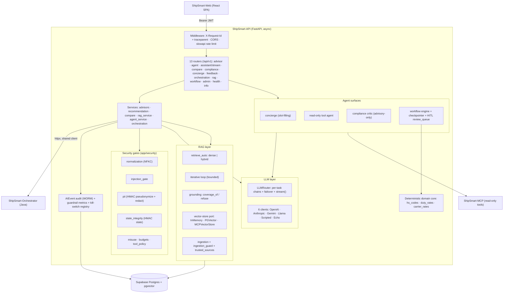

**Patterns:** hexagonal ports-and-adapters (vector store, conversation store,
domain providers, audit sink) · composition root (`bootstrap.py` → `app.state`)
· strategy (per-task provider) · chain of responsibility (failover, gates).

---

## Request flow

**Figure 2 — `/assistant` and `/assistant/stream`, with four refusal exits.**
The pipeline refuses on injection, forged state, weak grounding, and
schema-invalid output — before and after the model call. The happy path always
ends typed and audited.

```mermaid
flowchart LR
    A[Ingress] --> B["mint X-Request-Id · rate limit"]
    B --> C["normalize: NFKC, zero-width strip, homoglyph fold, language-ID"]
    C --> D{"injection_gate severity"}
    D -->|block| R1["safe refusal + guardrail tag"]
    D -->|allow / neutralize| E["pii: redact + pseudonymize"]
    E --> F["state_integrity: verify HMAC state"]
    F -->|unsigned/forged| R2["state treated as empty / approval rejected"]
    F --> G["RAG: retrieve_auto + grounding check"]
    G -->|coverage too low| R3["grounded refusal (no hallucination)"]
    G --> H["assemble(): fenced prompt"]
    H --> I["LLMRouter: task chain, failover"]
    I --> J["output_validator: schema check, 1 corrective retry"]
    J -->|invalid twice| R4["safe fallback + guardrail:structured_output_invalid"]
    J --> K["apply_policy: auto / confirm / never (rule-derived)"]
    K --> L["AIEvent audit (WORM)"]
    L --> M["typed AssistantResponse | SSE stream"]
```

---

## The LLM router

**Figure 3 — task routing + failover: retryable errors fail over; terminal
errors fail fast; the chain ends at a keyless echo.** Swap providers by env; a
provider outage degrades — it never 500s. `GET /ready` shows the resolved
chains in production.

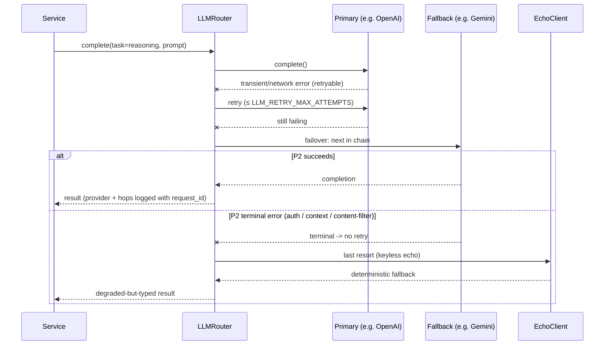

- Per-task chains from env (`LLM_PROVIDER_REASONING`, `LLM_PROVIDER_SYNTHESIS`).
- Typed error taxonomy (`classify_provider_error`); every hop logged.
- Native tool-calling (`complete_with_tools`) with text-mode fallback.
- Per-request budgets: LLM/tool/token ceilings, temperature clamping.

---

## RAG done properly

**Figure 4 — hybrid retrieval with grounding-or-refuse.**

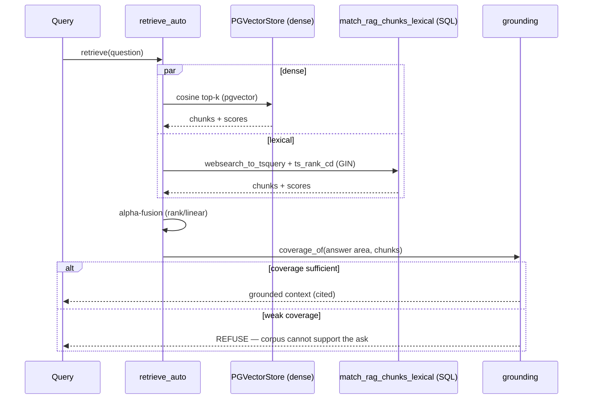

**Figure 5 — the bounded iterative loop (state machine).** The model may
reformulate a weak query, but it cannot run away.

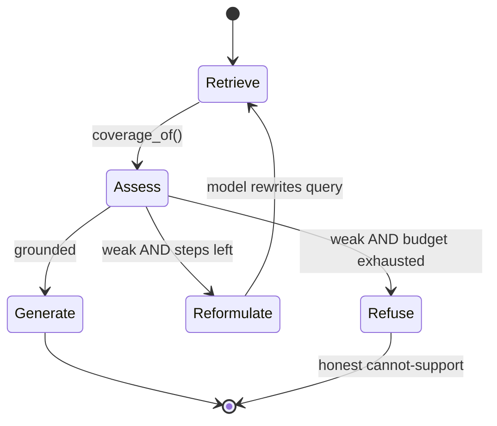

Plus **supply-chain hygiene**: `ingestion_guard` + `trusted_sources` (source
allowlist + scan/quarantine — a poisoned document can't enter the corpus) and
**embedding-version governance** (`embedding_compat` — a fail-closed startup
check; no silent mixed vector spaces).

---

## The guardrail control plane

**Figure 6 — one prompt-assembly choke point for every feature.**

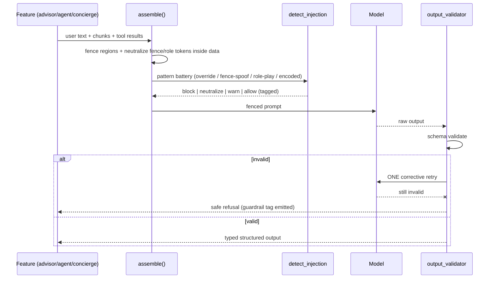

Input hygiene (NFKC + zero-width strip + homoglyph fold + language-ID) runs
before the fences; `scan_output` leak-scans after the model. The deterministic
**apply-policy** decides auto/confirm/never from **rule-derived confidence +
field risk — never model self-report**. Every decision emits a `guardrail:*`
tag — the same vocabulary the eval suite's coverage gate joins on.

---

## Streaming & the typed assistant contract

**Figure 7 — SSE: deltas stream; failover only before the first token.**

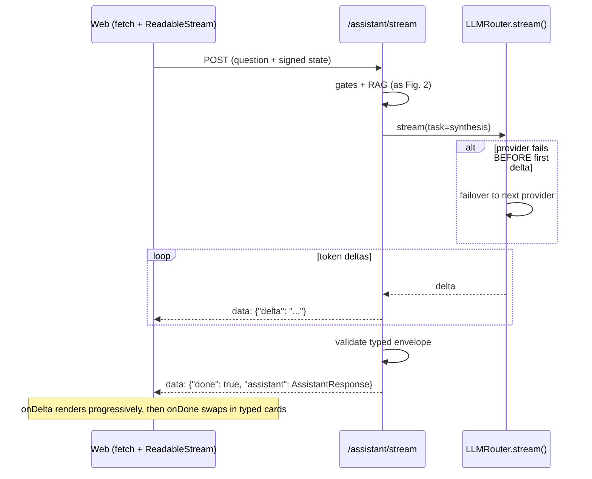

The envelope is a **discriminated union** (`shipping_option | comparison |
missing_info | policy_answer`) mirrored field-for-field by the Web's TypeScript
types and parity-tested in CI. Even refusals stream.

---

## Agent surfaces

**Figure 8 — the read-only tool agent loop.**

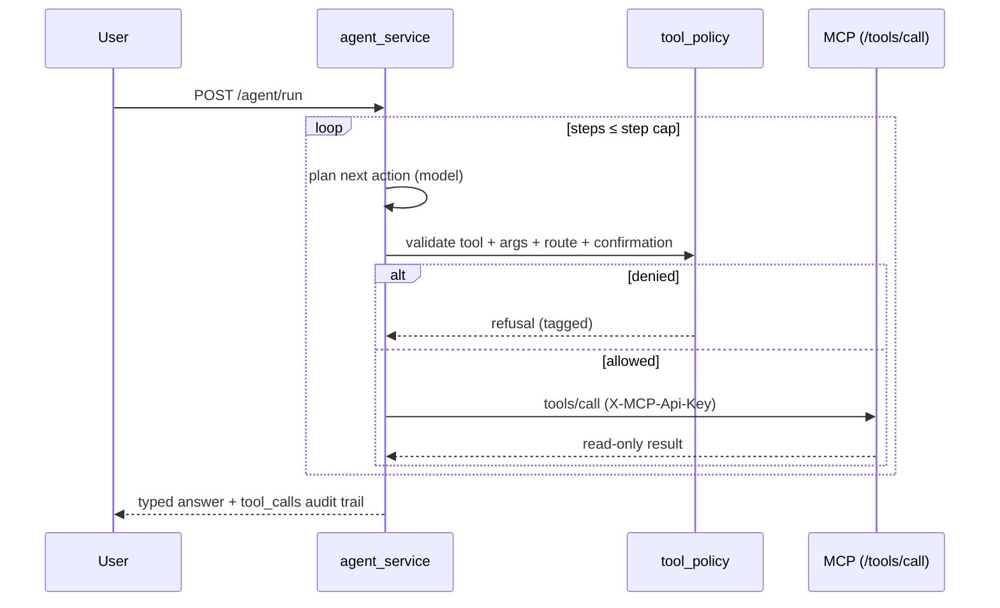

**Figure 9 — the durable workflow with human-in-the-loop (state machine).**

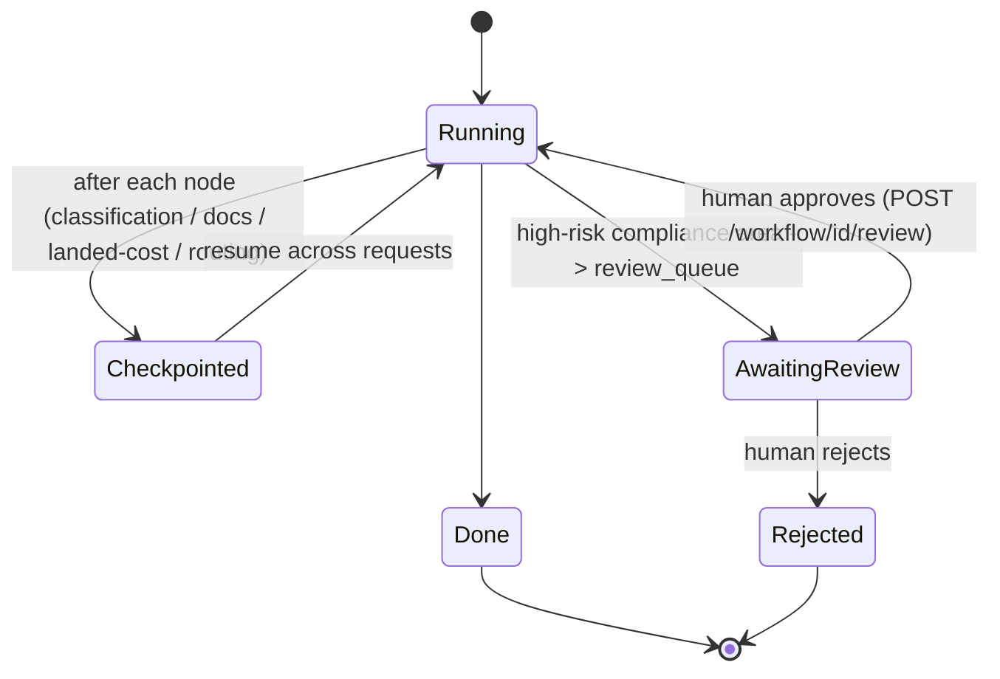

| Surface | What it is | Containment |
|---|---|---|
| **Concierge** | multi-turn slot-filling chat; deterministic intent extraction with LLM fallback | client-owned **HMAC-signed** state; server-side recall store |
| **Tool agent** | model-driven plan→retrieve→call loop | step/retrieval caps · pre-execution tool policy · read-only |
| **Compliance** | areas → structural rules → critic | **advisory-only**: never a fabricated clearance |
| **Workflow** | checkpointed multi-agent run over the deterministic domain core | suspends to a human review queue |

---

## Object design (OOD)

**Figure 10 — the LLM layer and typed outputs.** The seven gate modules are
pure-Python units with no framework coupling — which is why 499 tests run
keylessly in minutes.

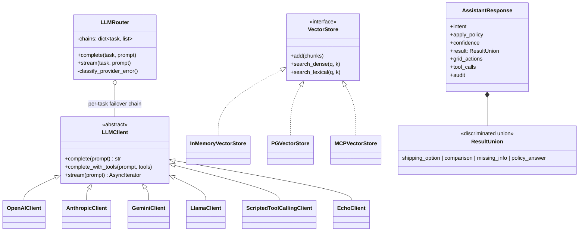

---

## Data flow & privacy

**Figure 11 — where identity and free text are protected.** Raw identity never
reaches the ledger — `session_id_hash` is an HMAC pseudonym; free text is
redacted before persistence; `prompt_version` / `schema_version` /
`embedding_version` make any answer reproducible.

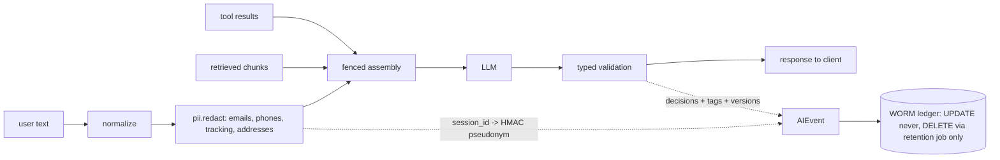

---

## Observability, audit & kill-switches

- `X-Request-Id` + W3C `traceparent` across Web → API → Java → MCP;
  ContextVar-scoped into every log line.
- **AIEvent** per model/tool call → the WORM Postgres ledger (retention
  30d/13mo/24mo classes); guardrail metrics with volume-floored alerts (the SQL
  twin `ai_guardrail_daily` lives in ShipSmart-Infra).
- `GET|POST /api/v1/admin/ai-controls`: token-gated runtime kill-switches for
  `agent · concierge · workflow · compliance · rag` — every flip audited with
  actor + reason; **guardrails are never killable**.

| Threat | Control |
|---|---|
| Prompt injection / fence-spoof | fencing + neutralization + `detect_injection` |
| Obfuscated / multilingual jailbreak | NFKC + zero-width + homoglyph + language-ID |
| Forged approvals / tampered context | HMAC-signed state; unsigned ⇒ empty |
| Fabricated structure / leakage | schema validation + retry + `scan_output` |
| Unauthorized / costly tool calls | `tool_policy` + budgets |
| PII in logs | redaction + pseudonymization + WORM ledger |
| Runaway feature | audited kill-switch (capability only) |

---

## Performance & availability

**Latency budget (target):**

| Stage | Budget *(target)* |
|---|---|
| Gates (normalize + injection + PII + state) | 40 ms |
| Retrieval (hybrid, pooled) | 120 ms |
| LLM first token (streamed) | 700 ms |
| Output validation + apply-policy | 30 ms |
| **First token, end-to-end** | **< 1 s** |

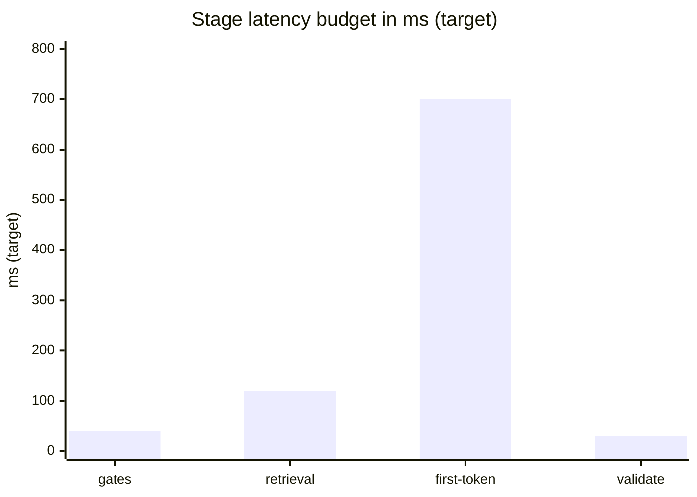

**Degradation matrix (coded behaviors, facts):**

| Dependency down | Behavior |
|---|---|
| Primary LLM provider | retry → failover chain → EchoClient (typed, deterministic) |
| Embedding key absent | `LocalHashEmbedding` (keyless) |
| MCP unreachable | 503 for tool paths — never a crash |
| Conversation store | recall disabled; boot continues |
| Feature flagged off | endpoint 404s |
| Feature kill-switched | runtime off, audited; guardrails stay on |

---

## Endpoint surface

| Group | Endpoints |
|---|---|
| Advisory | `POST /advisor/shipping` · `/advisor/tracking` · `/advisor/recommendation` |
| Assistant | `POST /concierge/chat` · `GET /concierge/{session_id}` · `POST /assistant/stream` (SSE) |
| Agent | `POST /agent/run` · `GET /agent/tools` |
| Compliance / Workflow | `POST /compliance/check` · `POST /workflow/process` · `POST /workflow/{id}/review` · `GET /workflow/{id}` |
| RAG / Compare | `POST /rag/query` · `POST /rag/ingest` · `POST /compare` |
| Ops | `GET /health` · `GET /ready` · `GET /info` · `POST /feedback` · `GET|POST /admin/ai-controls` |

---

## Deployment topology

**Figure 12 — production layout.** `/docs` dev-only; features env-flagged;
`GET /ready` is the wiring inspection.

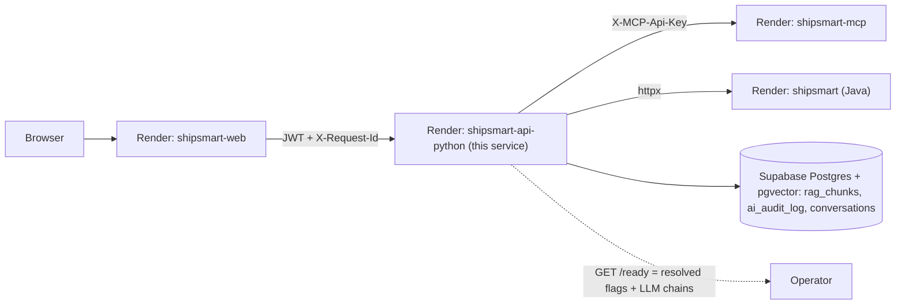

---

## Running locally

```bash
uv sync                                                    # deps (lockfile)
uv run uvicorn app.main:app --reload --host 0.0.0.0 --port 8000
curl localhost:8000/ready                                  # resolved wiring
```

Runs fully keyless by default (echo LLM, in-memory vector store, mock domain
adapters). Point it at siblings with `SHIPSMART_MCP_URL=http://127.0.0.1:8001`
and `INTERNAL_JAVA_API_URL=http://127.0.0.1:8080` — or boot everything at once
with ShipSmart-Test's `scripts/run-stack.sh`.

## Configuration

12-factor via `pydantic-settings`. The interesting dials:

| Env | Effect |
|---|---|
| `LLM_PROVIDER_REASONING` / `LLM_PROVIDER_SYNTHESIS` | per-task provider (+ failover chain) |
| `AGENT_ENABLED` · `CONCIERGE_ENABLED` · `WORKFLOW_ENABLED` · `COMPLIANCE_ENABLED` | AI surfaces — **404 when off**, conservative defaults |
| `GUARDRAILS_ENABLED` · `FEEDBACK_ENABLED` | control plane + feedback loop |
| `RAG_AUTO_INGEST` | first-boot corpus ingestion |
| `DATABASE_URL` | pgvector store (absent ⇒ in-memory) |
| `SHIPSMART_MCP_URL` / `SHIPSMART_MCP_API_KEY` | tool server hop |

## Tests & quality gates

```bash
uv run pytest            # 499 tests / 71 files — hermetic, zero keys
uv run ruff check .      # lint (E,F,I,N,W,UP)
```

Local eval harnesses: `scripts/agentic_eval.py`, `scripts/compliance_eval.py`,
`scripts/workflow_eval.py`, `scripts/perf_check.py`. Cross-repo: the typed
contract, decision-tag registry, trust boundary, and guardrail coverage are
asserted by **ShipSmart-Test** (10 contract suites + a six-layer eval system).

## License

See [LICENSE](./LICENSE).
