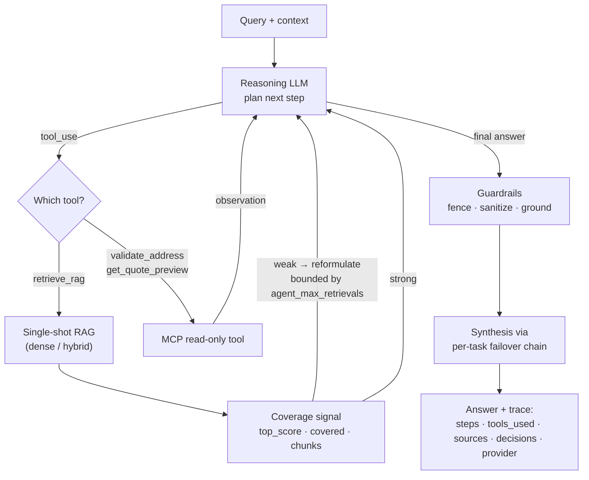
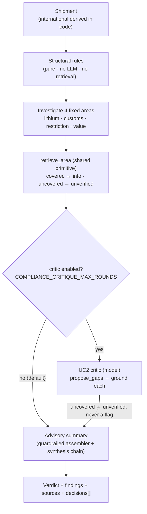
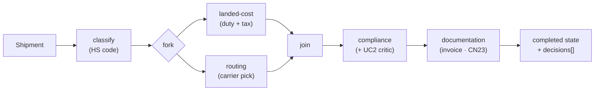
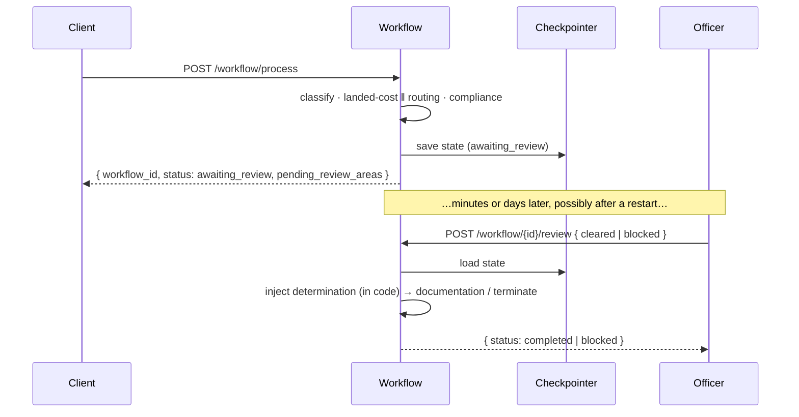

# ShipSmart — FastAPI AI Service (`api-python`)

[](https://fastapi.tiangolo.com/)
[](https://www.python.org/)
[](https://docs.astral.sh/uv/)
[](https://github.com/pgvector/pgvector)
[](#spotlight-the-concierge-agent)
[](#tests)
[](https://render.com/)
[](./LICENSE)

> An async **AI-orchestration microservice** that turns a multi-provider LLM stack into a
> grounded shipping **concierge** — a model-driven **agent loop**, **hybrid + iterative RAG**,
> **prompt-injection guardrails**, and **per-task provider failover** — all behind a
> hermetic **445-test** suite.

AI / orchestration service for the ShipSmart shipping platform. Owns no transactional
data; provides RAG-grounded shipping advice, a tool-calling concierge agent, tracking
guidance, recommendation scoring, and tool orchestration on top of a multi-provider LLM
router. Every external dependency degrades gracefully — the service boots, answers, and
stays observable even with no API keys, no database, and no tool server.

**Stack:** FastAPI 0.135.3 · Python 3.13 (async) · uv · pgvector · slowapi · OpenAI / Anthropic (Claude) / Gemini / Ollama / Echo

---

## Table of contents

- [Engineering highlights](#engineering-highlights)
- [Spotlight: the Concierge agent](#spotlight-the-concierge-agent)
- [Spotlight: compliance review (UC2)](#spotlight-compliance-review-uc2)
- [Spotlight: the multi-agent workflow (UC3)](#spotlight-the-multi-agent-workflow-uc3)
- [Spotlight: durability & human-in-the-loop (UC4)](#spotlight-durability--human-in-the-loop-uc4)
- [Retrieval modes](#retrieval-modes)
- [The ShipSmart ecosystem](#the-shipsmart-ecosystem)
- [What this service does](#what-this-service-does)
- [Architecture inside this service](#architecture-inside-this-service)
- [Running locally](#running-locally)
- [Environment variables](#environment-variables)
- [Tool orchestration: how selection works](#tool-orchestration-how-selection-works)
- [Recommendations + Java hydration](#recommendations--java-hydration)
- [MCP Server (separate repo)](#mcp-server-separate-repo)
- [Deployment (Render)](#deployment-render)
- [Smoke tests](#smoke-tests)
- [Tests](#tests)
- [Cross-service contracts](#cross-service-contracts)
- [Operational notes](#operational-notes)
- [Spotlight: the Conversational Concierge](#spotlight-the-conversational-concierge-form--chat-sync)
- [License](#license)

---

## Engineering highlights

The parts worth a closer look — each maps to real, tested code in this repo:

| | Capability | Why it's interesting |
|---|---|---|
| 🤖 | **Model-driven Concierge agent** | A genuine reason→act→observe loop (`app/services/agent_service.py`). The model plans, calls read-only tools, and **conditionally re-retrieves** when knowledge-base coverage is weak — bounded by hard step + retrieval caps, guarded against degenerate query loops. |
| 🧰 | **Native tool-calling with graceful fallback** | Claude drives the loop with native function calling; providers without it fall through to a single-pass text tool-selection — and a keyless `scripted` stub runs the whole loop with **no API keys** for demos and CI. |
| 🔀 | **Multi-provider LLM router + failover** | Each task (`reasoning`, `synthesis`) routes to its own provider, with a request-time **failover chain** (retry → next provider → always-terminating `echo`). Per-task model/temperature/token overrides. The app never crashes on LLM config. |
| 🛡️ | **Prompt-injection guardrails + grounding** | All prompt assembly flows through one assembler (`app/llm/guardrails.py`): role separation, untrusted-data fencing, injection detection (block or neutralize), and **grounding** — answer only from retrieved data or refuse, never guess. |
| 🔎 | **Retrieval that scales by config** | Single-shot dense → **hybrid** (dense + BM25/Postgres-lexical fusion) → **iterative** (bounded plan→retrieve→assess loop). All behind flags; defaults reproduce the simple path. |
| 🔭 | **Observability built in** | W3C `traceparent` + `X-Request-Id` minted/propagated across every hop (Java, MCP), structured logging, a `decision_path` trace on every answer, and a `/ready` probe that reports the live wiring. |
| 🧪 | **Hermetic-by-construction tests** | **445 tests in ~4s**, zero network, zero real keys — an autouse fixture pins every test to a self-contained profile. Includes an agentic eval harness (`scripts/agentic_eval.py`). |
| 🧩 | **Polyglot microservice design** | One of six sibling repos: this Python AI service alongside a Java/Spring transactional API, a React SPA, an MCP tool server, a Supabase/Infra repo, and a cross-repo integration-test harness — communicating over typed HTTP contracts. |

---

## Spotlight: the Concierge agent

`POST /api/v1/agent/run` is the newest and most interesting surface: a **model-driven,
read-only** agent that plans and calls tools to answer free-text shipping questions, then
returns a grounded answer **plus its full reasoning trace**.



**What makes it more than a tool-call wrapper:**

- **Conditional, bounded re-retrieval.** Each `retrieve_rag` result leads with a coverage
  signal (`top_score`, `covered`, `chunk_count`). On weak coverage the model reformulates
  with a *different, more specific* query and searches again — capped by `AGENT_MAX_RETRIEVALS`,
  guarded against repeating an identical query, and honest when a sub-area stays uncovered.
  A well-covered first hit stays single-shot.
- **The control flow is the model's; retrieval stays deterministic.** The agent owns the
  loop; the RAG layer underneath has no LLM in its control flow. (This is why the
  deterministic loop is named `iterative`, not "agentic" — see [Retrieval modes](#retrieval-modes).)
- **Reuse over reinvention.** MCP tools dispatch through the same `execute_tool` path as
  `/orchestration` (input validation, 502 handling); the final answer goes through the same
  guardrailed assembler and synthesis failover chain as the RAG path. A tool error becomes
  an *observation the model can recover from*, not a 500.
- **Degrades to keyless.** Providers without native tool-calling fall back to a single-pass
  text tool-selection; the `scripted` provider runs the full loop deterministically with no
  keys at all.
- **Read-only, day-1.** The agent plans, retrieves, and calls read-only tools. It never
  persists.

**Sample request / response:**

```bash
curl -X POST http://localhost:8000/api/v1/agent/run \
  -H 'Content-Type: application/json' \
  -d '{
        "query": "Can I ship a power bank to Berlin, and what would it cost from 10001?",
        "context": {"origin_zip": "10001", "destination_zip": "10115", "weight_lbs": 2}
      }'
```

```jsonc
{
  "answer": "Power banks ship as lithium-battery dangerous goods … (grounded answer)",
  "tools_used": ["retrieve_rag", "get_quote_preview"],
  "sources": [{"source": "restrictions.md", "chunk_index": 3, "score": 0.81}],
  "steps": [
    {"step": 1, "tool": "retrieve_rag", "observation": "coverage: top_score=0.81 covered=true chunks=3 …"},
    {"step": 2, "tool": "get_quote_preview", "observation": "{\"service\":\"Express\", …}"}
  ],
  "decisions": ["agent:plan", "agent:step1", "agent:tool:retrieve_rag", "agent:retrieve:1",
                "agent:step2", "agent:tool:get_quote_preview"],
  "provider": "anthropic"
}
```

The `decisions[]` trace tags every branch the agent took, and `provider` reports who
actually answered — so the loop is debuggable without reading logs.

---

## Spotlight: compliance review (UC2)

`POST /api/v1/compliance/check` reviews a shipment for compliance concerns and returns an
**advisory** verdict, individual findings, a grounded summary, and the full decision trail.
It is a **deterministic** flow with **one optional model-in-the-loop step** — the honest
distinction this codebase insists on.



**What makes it honest, not hand-wavy:**

- **Deterministic spine.** Structural rules read only the shipment (e.g. *international +
  no declared value → customs value missing*) — pure, reproducible, no model. The four
  fixed areas are grounded through the **same `retrieve_area` primitive the Concierge uses**.
- **Uncovered ⇒ `unverified`, never a fabricated flag.** This is the load-bearing
  invariant. When the knowledge base can't cover an area, the system says so — it never
  invents a clearance or a violation.
- **The critic is the only model in the loop — and it can only direct attention.** With
  `COMPLIANCE_CRITIQUE_MAX_ROUNDS > 0`, a model proposes *additional* areas via a
  `propose_gaps` tool call; each proposal is then **grounded the same way**. The model never
  asserts a conclusion. Without native tool calling (the keyless default) the critic is a
  deterministic no-op.
- **Advisory only.** The summary prompt forbids "compliant/cleared"; the verdict is
  `action_required` / `review_recommended` / `advisory`. This assists a human reviewer.
- **Keyless-friendly.** Unlike the advisor/agent routes, `/compliance/check` needs no MCP
  tools — only the LLM router + RAG — so it works out-of-the-box in local dev.

```bash
curl -X POST http://localhost:8000/api/v1/compliance/check \
  -H 'Content-Type: application/json' \
  -d '{
        "origin_country": "US", "destination_country": "BR",
        "declared_value_usd": 600,
        "description": "camera drone with lithium battery"
      }'
```

```jsonc
{
  "verdict": "action_required",
  "summary": "Flags: lithium cells are Class 9 dangerous goods … value_threshold could not be verified — needs review.",
  "findings": [
    {"area": "dangerous_goods_declaration", "status": "flag", "kind": "structural", "detail": "…"},
    {"area": "import_restriction", "status": "info", "kind": "investigation", "sources": [...]},
    {"area": "value_threshold", "status": "unverified", "kind": "investigation", "detail": "…needs review"}
  ],
  "decisions": ["compliance:plan", "compliance:structural:dangerous_goods_declaration",
                "compliance:investigate:lithium_battery", "lithium_battery:covered",
                "compliance:verdict:action_required"],
  "critique_rounds": 0,
  "provider": "openai"
}
```

`python scripts/compliance_eval.py` runs this keyless and contrasts the critic OFF vs ON on
a drone-into-Brazil case — showing the critic ground a destination-specific area the four
fixed areas under-cover, all visible in `decisions[]`.

---

## Spotlight: the multi-agent workflow (UC3)

`POST /api/v1/workflow/process` is the **second front door** — proactive and **multi-agent**.
Where the Concierge answers one question, the workflow runs a shipment through a sequence of
**specialist agents** and returns the assembled result with its full decision trail.



**What makes it real architecture, not a script:**

- **Hand-rolled, deterministic engine — no framework.** `StateMachineEngine` (behind a
  `WorkflowEngine` Protocol) sequences nodes and forks the independent landed-cost + routing
  stages with `asyncio.gather`, then **merges deterministically** (fixed node order) so the
  result is reproducible regardless of which finishes first. **No `langgraph` dependency** — a
  `LangGraphEngine` could drop in behind the same Protocol with zero change elsewhere.
- **LLM at the edges, deterministic core.** Code sequences the stages and picks (top HS
  candidate, cheapest carrier); the only model in the loop is the compliance stage (the UC2
  critic + summary). Classification/duty/routing/docs are deterministic.
- **Ports & adapters everywhere external.** Each agent depends on a `Protocol`
  (`ClassificationProvider`, `DutyRateProvider`, `CarrierProvider`, `DocRenderer`), never a
  concrete backend. The defaults are honest, clearly-labeled `Mock*` adapters over realistic
  data tables in `app/domain/data/`; a real HS DB / duty engine / carrier API (via MCP) is a
  future adapter — a swap, not a rewrite (`MCPCarrierAdapter` is the documented seam).
- **One reused engine.** The compliance stage **is** the UC2 flow from the standalone
  `/compliance/check` — wrapped as a node. Its `compliance:*` / `critique:*` tags fold into
  the workflow's `decisions[]`, so the whole multi-agent run is one replayable trail.
- **Everything off by default.** `WORKFLOW_ENABLED=false` ⇒ 404; a default run behaves exactly
  as before.

```bash
curl -X POST http://localhost:8000/api/v1/workflow/process \
  -H 'Content-Type: application/json' \
  -d '{
        "origin_country": "US", "destination_country": "BR",
        "declared_value_usd": 600, "weight_lbs": 3,
        "description": "camera drone with lithium battery"
      }'
```

```jsonc
{
  "workflow_id": "5208e160b7a6…",
  "status": "completed",
  "hs_code": "8806", "hs_title": "Unmanned aircraft",
  "landed_cost": {"duty_usd": 30.0, "tax_usd": 63.0, "total_landed_usd": 693.0, "trade_note": ""},
  "recommended_carrier": {"carrier": "GlobalPost", "service": "Economy", "price_usd": 8.40, "estimated_days": 12},
  "compliance": {"verdict": "action_required", "unverified_areas": ["lithium_battery", "import_restriction", …]},
  "documents": ["packing_list", "commercial_invoice", "customs_declaration_cn23"],
  "decisions": ["workflow:start", "workflow:classify:8806", "workflow:landed_cost:computed",
                "workflow:routing:GlobalPost:Economy", "compliance:plan", …, "workflow:complete"]
}
```

---

## Spotlight: durability & human-in-the-loop (UC4)

The workflow doesn't just run — it can **pause for a human and survive a restart**. When the
compliance stage leaves a **high-risk area unverified** (`WORKFLOW_HIGH_RISK_AREAS`, default
`lithium_battery, import_restriction`), the workflow checkpoints itself and suspends instead of
guessing.



- **Interrupt, not guess.** An `unverified` high-risk area ⇒ `status="awaiting_review"`, a
  `ReviewItem` enqueued, `workflow:interrupt:human_review` tagged, state checkpointed, suspend.
- **Durable by a real swap.** `WorkflowCheckpointer` port with `InMemoryCheckpointer` (default)
  and `SqliteCheckpointer` (`WORKFLOW_DURABLE=true`, stdlib `sqlite3`, **zero new deps**). The
  full state round-trips through JSON, so resume reproduces it **exactly — even on a brand-new
  process** (proven by a test and `scripts/workflow_eval.py`'s "kill & resume").
- **The human is first-class in the audit trail.** The officer's `cleared`/`blocked` + note is
  injected into the outcome **in code** (the model never authored it) and recorded as
  `AuditEvent(actor="human", event="workflow:review:determination")` — "everything the system
  *and* every person did," one replayable trail.
- **`cleared`** continues to documentation and completes; **`blocked`** terminates at
  `status="blocked"`. `GET /workflow/{id}` returns the current state at any point.

```bash
# 1) start → suspends on an unverified high-risk gap
curl -sX POST localhost:8000/api/v1/workflow/process -H 'Content-Type: application/json' \
  -d '{"origin_country":"US","destination_country":"BR","weight_lbs":3,"description":"camera drone with lithium battery"}'
# → {"workflow_id":"…","status":"awaiting_review","pending_review_areas":["import_restriction","lithium_battery"]}

# 2) officer clears it → resumes to completion
curl -sX POST localhost:8000/api/v1/workflow/<id>/review -H 'Content-Type: application/json' \
  -d '{"determination":"cleared","note":"checked ANATEL homologation"}'
# → {"status":"completed","officer_determination":"cleared","documents":[…]}
```

`python scripts/workflow_eval.py` runs the whole lifecycle keyless (interrupt → block, and a
SQLite kill-and-resume → clear) and prints `PASS`.

---

## Retrieval modes

Retrieval scales with config; defaults reproduce the simplest path. The naming is honest:
only the [Concierge agent](#spotlight-the-concierge-agent) is model-driven — the modes below
are deterministic.

| Mode | Flag | What it does |
|---|---|---|
| **Normal** (default) | `RAG_MODE=normal` | Single-shot dense similarity search → synthesis. |
| **Hybrid** | `RAG_HYBRID=true` | Dense (pgvector cosine) **+** sparse (BM25 / Postgres lexical) retrieval, fused by `RAG_HYBRID_ALPHA`. Catches exact tokens — carrier names, service codes — that pure embeddings miss. Degrades to dense-only when no sparse backend is available. |
| **Iterative** | `RAG_MODE=iterative` | A bounded, **deterministic** plan→retrieve→assess loop: reformulate and retry on weak coverage (≤ `RAG_ITERATIVE_MAX_STEPS`), optionally escalate to MCP tools for ground truth, then ground + answer — or refuse deterministically when nothing covers the question. No LLM in its control flow. |

All three reuse the same guardrailed assembler, context budget, and synthesis failover chain.

---

## The ShipSmart ecosystem

This service is one of six sibling repositories. Clone them as
siblings of this directory when working on the full system.

| Repo | Role | Stack |
|------|------|-------|
| [ShipSmart-Web](https://github.com/nia194/ShipSmart-Web) | React SPA — user-facing UI | React 19, Vite, TypeScript |
| [ShipSmart-Orchestrator](https://github.com/nia194/ShipSmart-Orchestrator) | Java transactional API — **single writer** to Supabase Postgres; quotes, bookings, saved options, carrier integration | Spring Boot 3.4, Java 17 |
| **[ShipSmart-API](https://github.com/nia194/ShipSmart-API)** _(this repo)_ | Python AI/orchestration service — agent, RAG, advisors, recommendations, compliance (UC2), multi-agent workflow (UC3/UC4) | FastAPI, Python 3.13 |
| [ShipSmart-MCP](https://github.com/nia194/ShipSmart-MCP) | MCP tool server — `validate_address`, `get_quote_preview` (provider-pluggable) | FastAPI + MCP |
| [ShipSmart-Infra](https://github.com/nia194/ShipSmart-Infra) | Supabase migrations + edge functions, deployment configs, docs | Supabase, Render blueprints |
| [ShipSmart-Test](https://github.com/nia194/ShipSmart-Test) | Cross-repo integration harness — contract + live e2e suites, cross-service Postman collection | Python 3.13, pytest |

```
            ┌──────────────────────────────┐
            │       ShipSmart-Web          │
            │       React SPA · Vite       │
            └──────────────┬───────────────┘
                           │  Authorization: Bearer <Supabase JWT>
              ┌────────────┴────────────┐
              ▼                         ▼
┌──────────────────────────────┐   ┌──────────────────────────────┐
│  ShipSmart-Orchestrator      │◀──│  ShipSmart-API (this repo)   │
│  Java / Spring Boot          │   │  Python / FastAPI            │
│  Sole writer to Postgres     │   │  agent · RAG · advisors      │
│  Carrier integration (FedEx) │   │  Forwards JWT to Java for    │
│                              │   │  recommendation hydration    │
└──────────────┬───────────────┘   └──────────────┬───────────────┘
               │                                  │
               │                                  ▼
               │                   ┌──────────────────────────────┐
               │                   │        ShipSmart-MCP         │
               │                   │   shipping tools (HTTP/MCP)  │
               │                   │   validate_address, quotes   │
               │                   └──────────────────────────────┘
               ▼
┌──────────────────────────────┐
│   Supabase Postgres + Auth   │
└──────────────────────────────┘
```

This service owns no transactional data. It calls Java (`ShipSmart-Orchestrator`)
for quote hydration on the recommendation path, and MCP (`ShipSmart-MCP`) for
every tool execution. The same Supabase JWT the frontend sends here is
forwarded verbatim to Java so user-scoped queries continue to work without
re-issuing credentials.

---

## What this service does

| Capability | Endpoint | Notes |
|---|---|---|
| **Concierge agent** | `POST /api/v1/agent/run` | Model-driven reason→act→observe loop over MCP tools + `retrieve_rag`, with bounded conditional re-retrieval. Returns a grounded answer **+ full reasoning trace**. Read-only. See [spotlight](#spotlight-the-concierge-agent). |
| **Compliance review (UC2)** | `POST /api/v1/compliance/check` | Deterministic structural + grounded-area analysis with an optional model-in-the-loop critic. Returns an **advisory** verdict + findings + decision trail. Uncovered ⇒ `unverified`, never a fabricated flag. See [spotlight](#spotlight-compliance-review-uc2). |
| **Multi-agent workflow (UC3)** | `POST /api/v1/workflow/process` | Sequences specialist agents (classify → landed-cost ‖ routing → compliance(+UC2) → documentation) via a hand-rolled deterministic engine; ports & adapters behind every domain. OFF by default (`WORKFLOW_ENABLED`). See [spotlight](#spotlight-the-multi-agent-workflow-uc3). |
| **Workflow durability + HITL (UC4)** | `GET /api/v1/workflow/{id}` · `POST /api/v1/workflow/{id}/review` | Inspect a workflow and submit an officer determination (`cleared`/`blocked`) for one suspended on an unverified high-risk gap. Durable resume via in-memory or SQLite checkpointer. See [spotlight](#spotlight-durability--human-in-the-loop-uc4). |
| **Conversational Concierge** | `POST /api/v1/concierge/chat` · `GET /api/v1/concierge/{session_id}` | Multi-turn slot-filling assistant: gathers shipment slots, never re-asks for known ones, proactively guides, and dispatches to the agent / compliance / the **multi-agent workflow** (international + flags on). Persists each turn for **reload recall** and echoes full state for the form ⇄ chat sync. OFF by default (`CONCIERGE_ENABLED`). See [spotlight](#spotlight-the-conversational-concierge-form--chat-sync). |
| RAG query | `POST /api/v1/rag/query` | Embed → similarity search → LLM synthesis. Honors `RAG_MODE` / `RAG_HYBRID`. |
| RAG ingest | `POST /api/v1/rag/ingest` | Loads `data/documents/*` into the vector store. Auto-runs on first boot when pgvector is empty. |
| Shipping advisor | `POST /api/v1/advisor/shipping` | RAG + tool calls (`validate_address`, `get_quote_preview`) + LLM reasoning. |
| Tracking advisor | `POST /api/v1/advisor/tracking` | RAG + optional address validation + LLM guidance. Extracts next-step list. |
| Recommendation | `POST /api/v1/advisor/recommendation` | Deterministic scoring (cheapest/fastest/best_value/balanced). Hydrates from Java if `services` empty + `context.shipment_request_id` set. |
| Compare | `POST /api/v1/compare` | Decision-cockpit: compares 2–3 shipping options across scenarios (on-time, damage, price, speed) using LLM reasoning. |
| Tool orchestration | `POST /api/v1/orchestration/run` | Executes a registered tool. Auto-selects via regex first, then LLM-assisted fallback. |
| Tool catalog | `GET /api/v1/orchestration/tools` | JSON Schemas for all registered tools. |
| Service info | `GET /api/v1/info` | Returns service metadata (version, env, active providers, `shipping_scope`). No secrets exposed. |
| Liveness | `GET /health` | Liveness probe. |
| Readiness | `GET /ready` | Reports resolved `rag_mode`, `rag_hybrid`, `guardrails_enabled`, `agent_enabled`, `compliance_enabled`, `concierge_enabled`, `workflow_enabled`, `workflow_durable`, and per-task LLM failover chains — confirm the live wiring without reading logs. |

Interactive docs (dev only): `http://localhost:8000/docs`.

---

## Architecture inside this service

```
                          ┌──────────────────────────────────────┐
   request ──► route ──►  │ service layer                        │
                          │  • agent_service   (Concierge loop)  │
                          │  • shipping_advisor_service          │
                          │  • tracking_advisor_service          │
                          │  • recommendation_service            │
                          │  • compare_service                   │
                          │  • orchestration_service             │
                          │  • rag_service                       │
                          │  • java_client      (→ Java API)     │
                          └──┬──────────────┬──────────────┬─────┘
                             │              │              │
                       ┌─────▼─────┐ ┌──────▼─────┐ ┌──────▼──────┐
                       │ RAG       │ │ Tools (MCP)│ │ LLM         │
                       │ • embed   │ │ • registry │ │ • router    │
                       │ • store   │ │ • validate │ │ • failover  │
                       │   (pgvec  │ │ • quote    │ │ • guardrails│
                       │   /mcp    │ │            │ │ • budget    │
                       │   /mem)   │ │            │ │ • prompts   │
                       │ • chunk   │ │            │ │ • openai    │
                       │ • hybrid  │ │            │ │ • claude    │
                       │ • iterativ│ │            │ │ • gemini    │
                       │ • retrieve│ │            │ │ • llama·echo│
                       └───────────┘ └────────────┘ └─────────────┘
```

### Key modules

| Path | Purpose |
|---|---|
| `app/main.py` | Lifespan: builds embedding provider, vector store (memory, pgvector, or mcp), LLM router, and the remote `RemoteToolRegistry` backed by the ShipSmart-MCP service. Auto-ingests on first boot. |
| `app/services/agent_service.py` | **The Concierge agent** — model-driven reason→act→observe loop over the MCP tools + a `retrieve_rag` pseudo-tool, with bounded conditional re-retrieval on weak coverage and a keyless text-fallback for providers without native tool calling. |
| `app/api/routes/agent.py` · `app/schemas/agent.py` | `POST /api/v1/agent/run` route + request/response schemas (answer + reasoning trace). |
| `app/agents/compliance/` | **The compliance flow (UC2)** — `structural.py` (pure rules), `areas.py` (fixed decomposition), `critic.py` (the optional model-in-the-loop `propose_gaps` step), `service.py` (the pipeline), `models.py` (domain types). Uncovered areas surface as honest `unverified` findings, never fabricated flags. |
| `app/api/routes/compliance.py` · `app/schemas/compliance.py` | `POST /api/v1/compliance/check` route + schemas (advisory verdict + findings + decision trail). |
| `app/domain/` | **Ports & adapters (UC3)** — `ports.py` (Classification/DutyRate/Carrier/DocRenderer Protocols), `models.py` (frozen `HsCandidate`/`DutyQuote`/`CarrierQuote`/`GeneratedDoc`), `adapters/` (deterministic `Mock*` + the `MCPCarrierAdapter` seam + `default_providers()`), `data/` (HS / duty / carrier mock tables). |
| `app/agents/{classification,landed_cost,routing,documentation}_agent.py` | **Specialist agents (UC3)** — deterministic decision functions over the domain ports (pick top HS code, estimate landed cost, recommend a carrier, render docs). |
| `app/workflow/` | **Orchestration + durability (UC3/UC4)** — `state.py` (`WorkflowState`), `engine.py` (`WorkflowEngine` Protocol + hand-rolled `StateMachineEngine`, deterministic parallel merge), `nodes.py` (state↔agent adapters + `workflow:*` tags), `orchestrator.py` (`DurableWorkflow` stage graph + interrupt/resume), `checkpointer.py` (`WorkflowCheckpointer` port + InMemory/SQLite), `review_queue.py` (`ReviewQueue` port + InMemory). |
| `app/api/routes/workflow.py` · `app/schemas/workflow.py` | `POST /process` · `GET /{id}` · `POST /{id}/review` routes + schemas (state, decision trail, review determination). |
| `app/bootstrap.py` | Composition root — builds and wires every singleton (embedding, vector store, LLM router, RAG bundle, audit sink, MCP registry) onto `app.state`; `app/main.py` delegates its lifespan here. |
| `app/rag/grounding.py` | Shared grounding primitive (`CoverageSignal` / `coverage_of` / `retrieve_area`) reused by the Concierge agent **and** the compliance flow. No LLM in its control flow. |
| `app/core/audit.py` | Audit/tracing foundation — `AuditEvent` + swappable `AuditSink` (logging / in-memory); the compliance verdict is emitted here. |
| `app/services/mcp_client.py` | Thin HTTP client for the standalone ShipSmart-MCP server, plus `RemoteTool` / `RemoteToolRegistry` shims that ducktype the old in-process tool interface. |
| `app/core/config.py` | All settings (env-driven via pydantic-settings). |
| `app/core/cache.py` | TTL cache used by RAG, recommendation, and LLM tool selection. |
| `app/core/errors.py` | Centralized error handling: `AppError` exception class + global exception handlers returning consistent JSON error responses. |
| `app/core/logging.py` | Structured logging setup (`setup_logging()`) and named logger factory (`get_logger()`). |
| `app/core/middleware.py` | `RequestLoggingMiddleware` — logs method, path, status, duration; honors inbound `X-Request-Id` and W3C `traceparent` (mints them when missing), stores them in ContextVars, and echoes both back as response headers. |
| `app/core/correlation.py` | ContextVars (`request_id_var`, `traceparent_var`) + `outbound_headers()` helper. Lets outbound clients (Java API, MCP) forward the same correlation IDs on every hop. |
| `app/core/rate_limit.py` | Shared `slowapi` limiter (per IP). |
| `app/schemas/` | Pydantic request/response models (`advisor.py`, `compare.py`, `agent.py`, `compliance.py`). |
| `app/llm/router.py` | Task-based router: each task → its own provider with a request-time failover chain. |
| `app/llm/client.py` | `OpenAIClient`, `AnthropicClient` (native tool calling), `GeminiClient`, `LlamaClient`, `EchoClient`, and the keyless `ScriptedToolCallingClient`. |
| `app/llm/guardrails.py` | Prompt-assembly guardrails: role separation, fencing of untrusted data, prompt-injection detection (block/neutralize), and grounding/refusal. Every decision is tagged for `decision_path`. |
| `app/llm/budget.py` | Token estimation + context-budget trimming (drops lowest-scoring chunks to fit the window) and temperature clamping. |
| `app/llm/prompts.py` | Prompt templates for RAG, advisor, and compliance-summary flows (system instructions, context formatting). |
| `app/rag/embeddings.py` | `OpenAIEmbedding` + `LocalHashEmbedding` placeholder. |
| `app/rag/vector_store.py` | `VectorStore` ABC + `InMemoryVectorStore`. |
| `app/rag/pgvector_store.py` | Postgres + pgvector implementation (asyncpg, cosine via `<=>`, plus lexical search for hybrid). |
| `app/rag/mcp_vector_store.py` | MCP-based pgvector store via Supabase MCP server (alternative to direct asyncpg). |
| `app/rag/hybrid.py` | Dense + sparse (BM25 / Postgres lexical) retrieval fused by `RAG_HYBRID_ALPHA`. |
| `app/rag/iterative.py` | Deterministic bounded plan→retrieve→assess→ground loop (`RAG_MODE=iterative`). Not model-driven — that's the agent. |
| `app/rag/chunking.py` | Document chunking: splits text into overlapping chunks for embedding. |
| `app/rag/ingestion.py` · `retrieval.py` | Ingestion + retrieval pipeline (`retrieve_auto` picks dense vs. hybrid per config). |
| `app/services/compare_service.py` | LLM-driven multi-scenario shipping comparison logic. |
| `app/services/orchestration_service.py` | Rule-based + LLM-assisted tool selection. |
| `app/services/java_client.py` | Thin async wrapper around the shared `httpx` client → calls Java for `quotes` / `saved-options`. Forwards `X-Request-Id` / `traceparent` via `outbound_headers()` so requests stay correlated across the Java hop. |
| `app/dependencies/__init__.py` | FastAPI dependency injection providers (`Depends()` helpers). |
| `scripts/perf_check.py` | Post-launch performance check: measures response times for key endpoints against thresholds. |
| `scripts/agentic_eval.py` | Offline eval harness for the agent / iterative retrieval (coverage + decision-path checks). |

> Tools and carrier providers no longer live in this repo. They are served by
> the standalone **ShipSmart-MCP** service — see the [MCP Server](#mcp-server-separate-repo)
> section below.

---

## Running locally

### Prerequisites

- Python 3.13
- [`uv`](https://docs.astral.sh/uv/) 0.6.5+

### Install

```bash
uv sync
```

### Configure

```bash
cp .env.example .env
# edit .env — see "Environment variables" below
```

### Run

```bash
uv run uvicorn app.main:app --reload --host 0.0.0.0 --port 8000
```

The boot logs are intentionally loud about degraded modes:

```
WARNING  EMBEDDING_PROVIDER unset — using LocalHashEmbedding…
INFO     Vector store backend: memory (InMemoryVectorStore)
WARNING  Task 'reasoning' provider='<unset>' unavailable — falling back to echo
WARNING  SHIPSMART_MCP_URL is not set — advisor/orchestration routes will return 503…
INFO     Remote tool registry hydrated from MCP http://localhost:8001 (N tools)
```

If you see the first three warnings plus "no MCP URL", the server still
boots but the `/advisor/*`, `/agent/*`, and `/orchestration/*` routes return
503 until you point `SHIPSMART_MCP_URL` at a live ShipSmart-MCP instance. Set
the env vars below to unlock real behavior.

> **Tip — drive the agent with no API keys.** Set `LLM_PROVIDER_REASONING=scripted`
> (non-production only) for a deterministic, keyless tool-calling stub that exercises the
> full agent loop. Combined with the in-memory store and `EchoClient` synthesis, the whole
> service runs end-to-end with zero external dependencies.

---

## Environment variables

All flags live in `.env.example` with comments. Highlights:

### Shipping scope (platform policy)

```env
SHIPPING_SCOPE=worldwide       # worldwide (default, cross-border allowed) | domestic
DOMESTIC_COUNTRY=US            # ISO-3166 alpha-2 home country when SHIPPING_SCOPE=domestic
```

`domestic` restricts the platform to deliveries within `DOMESTIC_COUNTRY` — a cross-border
request is rejected with `422` and the concierge degrades to a domestic-only reply. The active
mode is published on `GET /api/v1/info`, and the Web, Orchestrator, and MCP siblings read and
enforce the same value (their `*_SHIPPING_SCOPE` / `SHIPPING_SCOPE` mirror this one).

### LLM routing

```env
LLM_PROVIDER=                  # legacy single-provider
LLM_PROVIDER_REASONING=        # advisors + agent loop (set "scripted" for a keyless demo)
LLM_PROVIDER_SYNTHESIS=        # /rag/query, recommendation summary, grounded answers
LLM_PROVIDER_FALLBACK=echo     # safety net
LLM_TIMEOUT=30
LLM_MAX_TOKENS=1024
LLM_TEMPERATURE=0.3
```

Each task picks its own provider. Empty inherits `LLM_PROVIDER`. Unknown
or missing-key providers fall through to `LLM_PROVIDER_FALLBACK`, then
to `EchoClient` (placeholder responses).

### Request-time failover + context budget

```env
LLM_FALLBACK_CHAIN=            # csv tried after the primary errors, e.g. openai,gemini,echo
LLM_RETRY_MAX_ATTEMPTS=2       # retries per provider before the next in the chain
LLM_MAX_CONTEXT_TOKENS=8000    # token budget for retrieved context fed to the LLM
```

Empty `LLM_FALLBACK_CHAIN` keeps the single-client path (today's behavior). A non-empty
chain always terminates with `echo`, so a request can never dead-end with no answer.
Per-task model / temperature / token overrides (`LLM_MODEL_REASONING`,
`LLM_TEMPERATURE_SYNTHESIS`, `LLM_MAX_TOKENS_*`, …) inherit the global value when empty.

### Provider keys

```env
OPENAI_API_KEY=
OPENAI_MODEL=gpt-4o-mini

ANTHROPIC_API_KEY=             # Claude — the provider with native tool calling for the agent
ANTHROPIC_MODEL=claude-sonnet-4-5

GEMINI_API_KEY=
GEMINI_MODEL=gemini-2.0-flash

LLAMA_BASE_URL=http://localhost:11434
LLAMA_MODEL=llama3.2
```

### Embeddings

```env
EMBEDDING_PROVIDER=            # "openai" or empty (= LocalHashEmbedding placeholder)
EMBEDDING_MODEL=text-embedding-3-small
EMBEDDING_DIMENSIONS=1536
```

### Vector store

```env
VECTOR_STORE_TYPE=memory       # "memory", "pgvector", or "mcp"
DATABASE_URL=                  # required when VECTOR_STORE_TYPE=pgvector
PGVECTOR_TABLE=rag_chunks
```

**pgvector** — direct asyncpg connection to Postgres + pgvector:

1. Create a `rag_chunks` table with a `vector(1536)` embedding column (matching `text-embedding-3-small`). If you use a different embedding dimension, alter the column accordingly.
2. Set `VECTOR_STORE_TYPE=pgvector` and `DATABASE_URL=postgresql://…`.
3. Restart. The first boot auto-ingests `data/documents/*` if the table is empty.

**mcp** — connects to Supabase pgvector through an MCP HTTP endpoint instead of direct asyncpg:

```env
MCP_SERVER_URL=               # MCP server HTTP endpoint (required for "mcp" backend)
MCP_API_KEY=                  # Optional API key for MCP server auth
```

### RAG settings

```env
RAG_AUTO_INGEST=true           # auto-ingest data/documents/* on startup if store is empty
RAG_DOCUMENTS_PATH=data/documents
RAG_TOP_K=3                    # number of chunks returned per similarity search
RAG_CHUNK_SIZE=500             # characters per chunk
RAG_CHUNK_OVERLAP=50           # overlap between consecutive chunks
```

### Retrieval modes (hybrid + iterative)

```env
RAG_MODE=normal                # normal (single-shot) | iterative  ("agentic" = deprecated alias)
RAG_HYBRID=false               # false = dense-only; true = dense + sparse (BM25 / lexical) fusion
RAG_HYBRID_ALPHA=0.5           # dense vs. sparse fusion weight (0..1; 1.0 = all dense)
RAG_ITERATIVE_MAX_STEPS=3      # max plan/retrieve steps when RAG_MODE=iterative
RAG_QUERY_LOG=false            # best-effort iterative-RAG traces to the rag_query_log table
```

See [Retrieval modes](#retrieval-modes). Defaults reproduce the simple dense, single-shot path.

### Guardrails

```env
GUARDRAILS_ENABLED=true              # fence/sanitize + detect prompt injection on advisor/RAG/agent calls
GUARDRAILS_BLOCK_ON_INJECTION=true   # block on detected injection (else neutralize and continue)
```

### Agent (Concierge)

```env
AGENT_ENABLED=true             # gate POST /api/v1/agent/run (404 when false)
AGENT_MAX_STEPS=5              # hard cost bound on the agent loop
AGENT_MAX_RETRIEVALS=2         # cap on retrieve_rag calls per run (1 = single-shot; >1 enables re-retrieval)
```

### Conversational Concierge (chat)

```env
CONCIERGE_ENABLED=false        # gate POST /api/v1/concierge/chat (404 when false)
CONCIERGE_MAX_TURNS=12         # soft bound on a single conversation
CONVERSATION_STORE=memory      # recall store: memory (keyless) | postgres (asyncpg + DATABASE_URL)
CONVERSATION_MAX_MESSAGES=50   # recall window: max transcript turns loaded
```

Stateful, multi-turn slot-filling chat, distinct from the Agent above. **Deterministic-first**
(regex + the pure `fold_turn` reducer keep it keyless-testable); an optional reasoning model
**enriches NLU** — compound intent, explicit corrections ("actually 15 lb"), and disambiguation —
and **rephrases** the proactive replies. The model proposes; code still merges, checks required
slots, and decides dispatch.

**Server-side recall:** each turn is persisted by an anonymous `session_id` (minted by the
server) behind a swappable port (`app/conversations/store.py`, mirroring the audit/checkpointer
seams). `GET /api/v1/concierge/{session_id}` replays the transcript + merged state so a chat
survives a page reload. In-memory by default (keyless); `CONVERSATION_STORE=postgres` is the
durable backend.

**Drives the full process when toggled on:** quote/tracking/advice reuse the agent (MCP tools);
compliance uses UC2; and an **international** shipment (worldwide scope) with
`COMPLIANCE_EXPLICIT_ENABLED` + `WORKFLOW_ENABLED` bridges into the existing multi-agent workflow
(classify → landed-cost ‖ routing → compliance → docs, with the human-review interrupt). The
default deployment (domestic / flags off) behaves exactly as before. Off by default.

### Compliance (UC2)

```env
COMPLIANCE_ENABLED=true              # gate POST /api/v1/compliance/check (404 when false)
COMPLIANCE_EXPLICIT_ENABLED=true     # additive: run the hard UC2 pass on the chat/workflow paths; false = normal flow only (also skips the workflow HITL interrupt)
COMPLIANCE_CRITIQUE_MAX_ROUNDS=0     # 0 = critic off (deterministic only); >0 enables the UC2 critic
COMPLIANCE_MAX_GAP_AREAS=3           # max gap areas accepted from the critic per round
COMPLIANCE_VALUE_THRESHOLD_USD=2500  # declared value (USD) that flags a commercial invoice (international)
```

Advisory only — this endpoint assists a human reviewer and never declares a shipment
"compliant" or "cleared". It needs no MCP tools (LLM router + RAG only).

### Workflow (UC3 / UC4)

```env
WORKFLOW_ENABLED=false               # gate /api/v1/workflow/* (404 when false)
WORKFLOW_DURABLE=false               # false = in-memory checkpointer; true = SQLite (survives restarts)
WORKFLOW_CHECKPOINT_PATH=workflow_checkpoints.db   # SQLite file when WORKFLOW_DURABLE=true
WORKFLOW_HIGH_RISK_AREAS=lithium_battery,import_restriction  # unverified area here → human review
```

Multi-agent durable workflow (classify → landed-cost ‖ routing → compliance(+UC2) →
documentation) with a human-in-the-loop interrupt. Like compliance it needs only the LLM router
+ RAG (the other stages use the deterministic mock domain adapters). Set `WORKFLOW_HIGH_RISK_AREAS`
empty to disable the interrupt (straight-through).

### Shipping provider

Carrier credentials (`SHIPPING_PROVIDER`, `UPS_*`, `FEDEX_*`, `DHL_*`,
`USPS_*`) no longer live in this service. They belong to the
**ShipSmart-MCP** repo, which owns all carrier-API calls. Configure
them there and point this service at its HTTP endpoint with
`SHIPSMART_MCP_URL` (below).

### Tools (delegated to ShipSmart-MCP)

```env
SHIPSMART_MCP_URL=http://localhost:8001   # standalone MCP tool server
SHIPSMART_MCP_API_KEY=                    # optional; must match MCP_API_KEY on the server
```

If `SHIPSMART_MCP_URL` is empty, the advisor, agent, and orchestration routes
return HTTP 503 (no tools available). The compliance route (UC2) is exempt — it
uses no MCP tools, so it works without the tool server. See the **ShipSmart-MCP**
repo for how to run the tool server locally.

### Rate limiting

```env
RATE_LIMIT_ADVISOR=10/minute       # /advisor/* endpoints
RATE_LIMIT_ORCHESTRATION=20/minute # /orchestration/run
RATE_LIMIT_COMPARE=10/minute       # /compare endpoint
RATE_LIMIT_AGENT=10/minute         # /agent/run endpoint
RATE_LIMIT_COMPLIANCE=10/minute    # /compliance/check endpoint
RATE_LIMIT_WORKFLOW=10/minute      # /workflow/process endpoint
RATE_LIMIT_CONCIERGE=60/minute     # /concierge/chat — interactive chat; one user easily exceeds 10/min
```

Per IP, via slowapi. Returns HTTP 429 when exceeded.

---

## Tool orchestration: how selection works

`POST /api/v1/orchestration/run` accepts `{ query, tool?, params }`.

1. **Explicit**: if `tool` is set, that tool runs directly.
2. **Auto / fast path**: deterministic regex rules in
   `orchestration_service._TOOL_PATTERNS`.
3. **Auto / slow path**: if regex misses *and* a reasoning LLM is
   configured, the orchestrator asks the LLM to pick exactly one tool
   from the registry (or `NONE`). Result is cached per query for 10
   minutes.

The `metadata.selection_method` field in the response tells you which
path fired (`rule` / `llm` / `none`). The [Concierge agent](#spotlight-the-concierge-agent)
reuses this same `execute_tool` path for its MCP tool calls.

---

## Recommendations + Java hydration

`POST /api/v1/advisor/recommendation` accepts a list of `services` and
`context`. If `services` is empty but `context.shipment_request_id` is
set, the route forwards the incoming `Authorization` header to the Java
API and pulls the actual quotes from
`GET /api/v1/quotes?shipmentRequestId=…` before scoring. This lets the
frontend ask for "ranked recommendations for shipment X" without
re-sending the quote list.

If Java is unreachable, the call degrades gracefully — empty
recommendations rather than a 500.

---

## MCP Server (separate repo)

The tool layer (`validate_address`, `get_quote_preview`, carrier
providers, MCP HTTP endpoints) lives in the separate **ShipSmart-MCP**
repo and is deployed as its own Render service.

This API calls that service through `app/services/mcp_client.py`:

- `McpClient` — async HTTP client for `/tools/list` and `/tools/call`.
- `RemoteTool` / `RemoteToolRegistry` — shims that implement the same
  interface the in-process tool layer used to expose, so
  `orchestration_service`, `agent_service`, `shipping_advisor_service`, and
  `tracking_advisor_service` are unchanged.

Contract (defined by ShipSmart-MCP):

| Method | Path          | Purpose                                              |
|--------|---------------|------------------------------------------------------|
| `GET`  | `/health`     | Liveness probe.                                      |
| `POST` | `/tools/list` | MCP tool catalog as JSON Schemas.                    |
| `POST` | `/tools/call` | Execute a tool by name.                              |

If `MCP_API_KEY` is set on the MCP server, set the matching
`SHIPSMART_MCP_API_KEY` here so requests pass the `X-MCP-Api-Key` header.

---

## Deployment (Render)

The repo ships a `render.yaml` Render Blueprint for a single service:

| Service | Entry point | Purpose |
|---|---|---|
| `shipsmart-api-python` | `app.main:app` | FastAPI AI/advisory service. Tools are delegated to the `shipsmart-mcp` service deployed from the ShipSmart-MCP repo. |

Build command: `pip install uv && uv sync`.

To deploy: connect the repo to Render and apply the Blueprint. Set all
`sync: false` env vars (secrets like `DATABASE_URL`, `OPENAI_API_KEY`)
in the Render dashboard before the first deploy.

---

## Smoke tests

After boot, with no extra config:

```bash
# liveness
curl http://localhost:8000/health

# readiness — resolved retrieval/guardrail flags + LLM failover chains
curl http://localhost:8000/ready

# tool catalog
curl http://localhost:8000/api/v1/orchestration/tools

# explicit tool execution (mock provider)
curl -X POST http://localhost:8000/api/v1/orchestration/run \
  -H 'Content-Type: application/json' \
  -d '{"query":"validate","tool":"validate_address","params":{"street":"1 Infinite Loop","city":"Cupertino","state":"CA","zip_code":"95014"}}'

# concierge agent (read-only reason→act→observe loop)
curl -X POST http://localhost:8000/api/v1/agent/run \
  -H 'Content-Type: application/json' \
  -d '{"query":"Can I ship a power bank to Berlin, and what would it cost from 10001?","context":{"origin_zip":"10001","destination_zip":"10115","weight_lbs":2}}'

# compliance review (UC2 — advisory; deterministic + optional critic)
curl -X POST http://localhost:8000/api/v1/compliance/check \
  -H 'Content-Type: application/json' \
  -d '{"origin_country":"US","destination_country":"BR","declared_value_usd":600,"description":"camera drone with lithium battery"}'

# multi-agent workflow (UC3 — set WORKFLOW_ENABLED=true; classify → landed-cost ‖ routing → compliance → docs)
curl -X POST http://localhost:8000/api/v1/workflow/process \
  -H 'Content-Type: application/json' \
  -d '{"origin_country":"US","destination_country":"BR","declared_value_usd":600,"weight_lbs":3,"description":"camera drone with lithium battery"}'

# workflow human-in-the-loop (UC4 — inspect a suspended workflow, then submit an officer determination)
curl http://localhost:8000/api/v1/workflow/<workflow_id>
curl -X POST http://localhost:8000/api/v1/workflow/<workflow_id>/review \
  -H 'Content-Type: application/json' \
  -d '{"determination":"cleared","note":"checked destination import rules"}'

# recommendation (deterministic scoring)
curl -X POST http://localhost:8000/api/v1/advisor/recommendation \
  -H 'Content-Type: application/json' \
  -d '{"services":[{"service":"Ground","price_usd":12.5,"estimated_days":5},{"service":"Express","price_usd":29,"estimated_days":1}],"context":{"urgent":true}}'
```

### Postman collection

[`postman/ShipSmart-API.postman_collection.json`](./postman/ShipSmart-API.postman_collection.json)
walks the same surfaces with assertions on every request: health + readiness (`/ready`
flag report), the concierge chat (a greeting is handled rather than RAG-dumped; a quote
request gathers/dispatches), a compliance check, the full workflow chain (`process` →
`GET {id}` → `review` → unknown-id `404`, chained through a `workflow_id` collection
variable — the review step accepts `200` completed or `409` already-terminal, since a
straight-through run has nothing to review), and compare / RAG / orchestration /
recommendation. A collection-level guard fails any request that returns a 5xx or takes
over 15s. The concierge and workflow folders assume `CONCIERGE_ENABLED=true` /
`WORKFLOW_ENABLED=true` on the target. Import it with
[`postman/environments/local.postman_environment.json`](./postman/environments/local.postman_environment.json)
(`base_url` defaults to `http://127.0.0.1:8000`), or run it headless:

```bash
npx newman run postman/ShipSmart-API.postman_collection.json \
  -e postman/environments/local.postman_environment.json
```

---

## Tests

```bash
uv run pytest          # 445 tests, ~4s, no network / no real keys
```

Tests live under `tests/` and use `pytest-asyncio` (async mode = auto).

**Hermetic by construction.** An autouse fixture in `tests/conftest.py`
(`_hermetic_settings`) pins every test to the self-contained profile —
`LocalHashEmbedding` + `InMemoryVectorStore` + `EchoClient`, no DATABASE_URL /
MCP URL — so the suite ignores the real provider config in your local `.env`
(OpenAI key, Supabase `DATABASE_URL`, pgvector). The MCP layer is served by a
`httpx.MockTransport`-backed `RemoteToolRegistry` (no live ShipSmart-MCP needed),
and the agent loop runs on the keyless `ScriptedToolCallingClient`.

Coverage spans the LLM router/fallback/budget, guardrails, dense/hybrid/iterative
RAG, the Concierge agent (loop, re-retrieval, route, native + text tool-calling),
the advisors, and `decision_path`. Service/seam coverage worth calling out:

| File | Focus |
| --- | --- |
| `test_agent_service.py` · `test_agent_route.py` | The agent loop end-to-end + the `/agent/run` route (404 when disabled, 503 when registry/router missing). |
| `test_concierge_state.py` · `test_concierge_nlu.py` · `test_concierge_service.py` · `test_concierge_route.py` | The concierge `fold_turn` reducer + deterministic extraction (lowercase routes, city → country/ZIP resolution, greeting detection), the don't-re-ask dispatch, the LLM-error degradation to the ready-summary, and the `/concierge/chat` route (404 when disabled, full-state echo). |
| `test_agent_reretrieval.py` | Conditional, bounded re-retrieval: weak-coverage reformulation, degenerate-query rejection, and the per-run cap. |
| `test_agent_llm.py` | Native tool-calling vs. the keyless text fallback (`NotImplementedError` → `select_tool_with_llm`). |
| `test_guardrails.py` | Injection detection, fencing/neutralization, grounding, and output leak scanning. |
| `test_hybrid.py` | Dense + sparse fusion (BM25 / lexical) and graceful degradation to dense-only. |
| `test_agentic.py` · `test_agentic_eval.py` | Iterative RAG loop + the offline eval harness. |
| `test_compare.py` | `/api/v1/compare` end-to-end on Echo → the deterministic fallback scenarios + the cache. |
| `test_java_client.py` | `JavaApiClient` hydration over MockTransport: success + every graceful-`None` failure mode. |
| `test_mcp_client.py` | `RemoteToolRegistry` hydration, a tool call, and MCP-down degrading to `success=false` (never raising). |
| `test_orchestration_service.py` | Rule + LLM-assisted tool selection (with caching) and the `AppError` mapping in `execute_tool`. |
| `test_middleware.py` | `X-Request-Id` / `traceparent` minting + echo and `outbound_headers()` propagation. |
| `test_pgvector_store.py` | SQL-shape contract (cosine operator; `match_rag_chunks_lexical($1,$2)` selecting `source, chunk_index, text, score`) via a fake asyncpg pool — no DB. |

### Lint & formatting

```bash
uv run ruff check .          # lint (line length, imports, pyflakes)
```

A `.pre-commit-config.yaml` wires **ruff** plus hygiene hooks (end-of-file fixer, trailing
whitespace, YAML, merge-conflict) — install once with `uvx pre-commit install`. CI
(`.github/workflows/ci.yml`) runs `ruff check .` then `pytest -q` on every push / PR.

---

## Cross-service contracts

When the Java API or MCP server change shape, update these files in
lockstep:

| Caller | Endpoint | Used by |
|---|---|---|
| **Web → Python** | `POST /api/v1/agent/run` | Concierge agent — free-text shipping tasks; returns answer + reasoning trace. |
| **Web → Python** | `POST /api/v1/concierge/chat` | Conversational concierge — stateful slot-filling chat; echoes the shipment `state` for the form ⇄ chat sync. |
| **Web → Python** | `POST /api/v1/advisor/shipping` | Shipping advisor page. |
| **Web → Python** | `POST /api/v1/advisor/tracking` | Tracking advisor page. |
| **Web → Python** | `POST /api/v1/advisor/recommendation` | Recommendations widget. Frontend may send `services[]` directly **or** just `context.shipment_request_id` and let this service hydrate from Java. |
| **Web → Python** | `POST /api/v1/compare` | Decision-cockpit compare page. |
| **Web → Python** | `POST /api/v1/rag/query` | RAG q&a over the shipping knowledge base. |
| **Python → Java** | `GET /api/v1/quotes?shipmentRequestId=…` | Recommendation hydration — forwards inbound `Authorization` header. See `app/services/java_client.py`. |
| **Python → MCP** | `POST /tools/list`, `POST /tools/call` | Every advisor/agent/orchestration tool call. See `app/services/mcp_client.py`. Auth via `X-MCP-Api-Key` when `SHIPSMART_MCP_API_KEY` is set. |

Schemas live in `app/schemas/` (`advisor.py`, `compare.py`, `agent.py`). Java DTO
changes for the recommendation hydration path should be mirrored in
`app/services/java_client.py`. MCP tool-catalog changes are picked up
automatically at boot — the `RemoteToolRegistry` hydrates from `/tools/list`.

Correlation: `RequestLoggingMiddleware` honours inbound `X-Request-Id`
and W3C `traceparent` (minting them when missing) and stashes them in
ContextVars. `outbound_headers()` (in `app/core/correlation.py`) propagates
them to both Java and MCP, so a single request can be `grep`'d end-to-end.

---

## Operational notes

- **Agent returns 404**: `AGENT_ENABLED=false`. Set it `true` to expose `POST /api/v1/agent/run`.
- **`/agent/*`, `/advisor/*`, or `/orchestration/*` return 503**: `SHIPSMART_MCP_URL` is empty or the MCP server is unreachable (the tool registry / LLM router is not initialized). Boot `ShipSmart-MCP` and re-check.
- **Reading the agent trace**: `decisions[]` tags every branch (`agent:step2`, `agent:retrieve:reformulate`, `agent:retrieve:uncovered`, `guardrail:blocked`…) and `provider` reports who actually answered — debug the loop without log diving.
- **Rate limit 429**: someone is hammering an `/advisor`/`/agent` endpoint. Tune `RATE_LIMIT_*` if legitimate.
- **Echo / scripted responses**: no real LLM provider keys are set. Set `OPENAI_API_KEY` + `LLM_PROVIDER_REASONING=openai` (or `ANTHROPIC_*` for native agent tool-calling) to enable real completions.
- **`is_valid: true` for any address**: the MCP server is running on the mock carrier. Switch `SHIPPING_PROVIDER` on the **ShipSmart-MCP** service to a real carrier (it owns those env vars now).
- **RAG returns nothing relevant**: you're on `LocalHashEmbedding`. Set `EMBEDDING_PROVIDER=openai`. For exact-token misses (carrier/service codes), try `RAG_HYBRID=true`.
- **RAG cleared on restart**: you're on `VECTOR_STORE_TYPE=memory`. Switch to `pgvector` + `DATABASE_URL`.
- **CORS errors from the frontend**: the web origin (e.g. `http://localhost:5173`) must be in `CORS_ALLOWED_ORIGINS`.

---

## Spotlight: the Conversational Concierge (form ⇄ chat sync)

`POST /api/v1/concierge/chat` is a **stateful, multi-turn** slot-filling chat — distinct
from the one-shot [Concierge **agent**](#spotlight-the-concierge-agent) (`/agent/run`).
It gathers the shipment **slots** over a few turns, **never re-asks for a slot it already
has**, then dispatches to an existing deterministic worker. It is the server half of the
**hybrid form ⇄ chat sync**: the ShipSmart-Web form and this chat are two views over one
shared shipment draft.

**What makes it more than a chat wrapper:**

- **`ConversationState.slots` is the shipment-context superset** — carrying every
  field the form provides (`origin`, `destination`, countries, dates, `priority`, and the
  primary package fields: `weight_lbs`, dims, `category`/`description`, `declared_value_usd`).
  The client sends these from the form even before any chat turn.
- **`fold_turn` is a pure reducer** — empty never overwrites non-empty; newest non-empty
  wins; an echoed value equivalent (after normalization) to the existing one is a no-op.
  Extraction returns only newly-derived entities, and the response **echoes the full
  merged state** so the client can patch the form fields.
- **Pre-filled slots are treated as satisfied (the core "don't re-ask" behavior)** —
  `run_concierge`'s required-slot check sees form-provided slots and dispatches straight to
  the worker instead of emitting a `concierge:clarify:*` turn.
- **Deterministic dispatch.** Compliance assembles a `Shipment` → the UC2 flow; quote /
  tracking / open questions route to the read-only **agent**, with an intent-shaped query
  built from the gathered slots (a terse last turn like "about 5 lbs" is a poor agent
  prompt). Known city names resolve to countries + representative ZIPs and a standard box
  is assumed when dimensions are omitted, so an origin/destination/weight conversation
  actually completes a quote preview — and an international route can bridge into the
  multi-agent workflow. The model only helps *extract* entities (with a keyless regex
  fallback that also parses lowercase routes) — it never quotes, books, or decides;
  assembling a worker's typed input is pure code.
- **Degrades, never 502s.** A pure greeting/smalltalk turn is welcomed and oriented
  (`concierge:greeting`) instead of being dispatched as an empty RAG query; a keyless
  deployment answers from the deterministic ready-summary rather than agent boilerplate;
  a mid-dispatch LLM provider failure falls back to that same summary
  (`concierge:dispatch:llm_degraded`); and the reply polish keeps the deterministic
  template whenever a rephrase would drop a clarifying question.
- **Off by default + keyless.** `CONCIERGE_ENABLED=false` ⇒ 404; the whole loop runs on
  the `EchoClient` + a deterministic regex extractor (no keys) for demos and CI.

```bash
curl -X POST http://localhost:8000/api/v1/concierge/chat \
  -H 'Content-Type: application/json' \
  -d '{"message":"ship from Atlanta to Seattle, 12 lb","state":null}'
```

No Java/MCP change — the draft is client-owned and the existing read-only
`GET /shipments/{id}` hydration path is reused.

---

## License

See [LICENSE](./LICENSE) for the full text.
