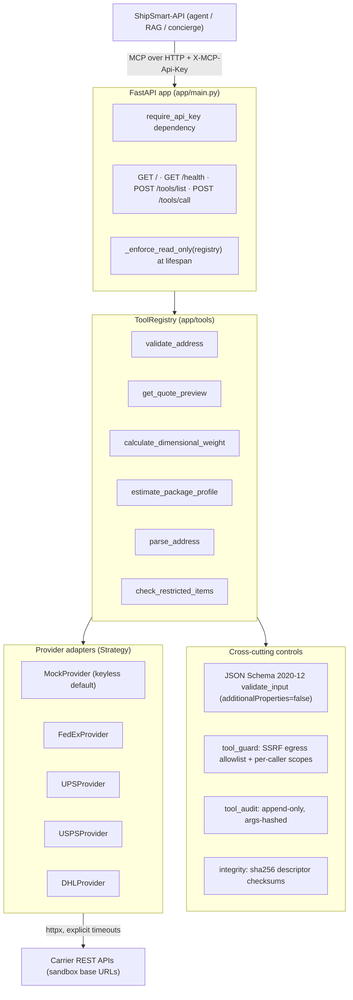
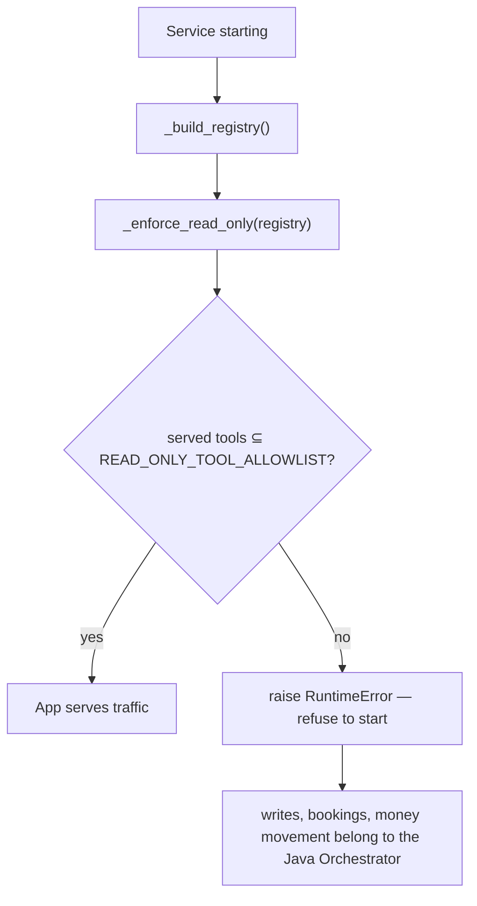
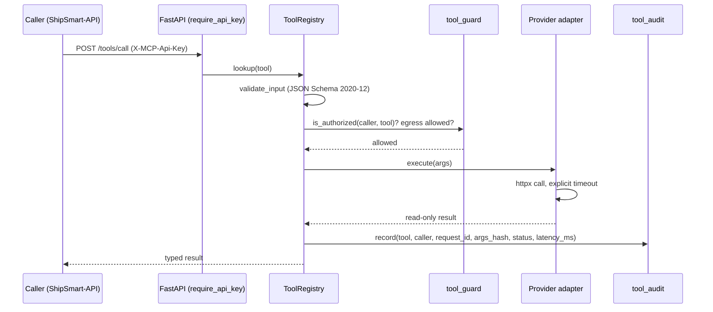
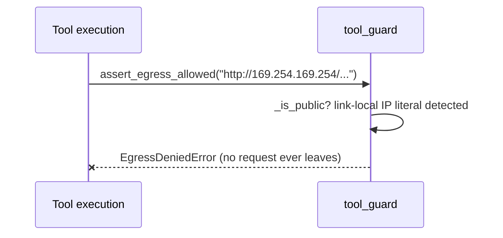
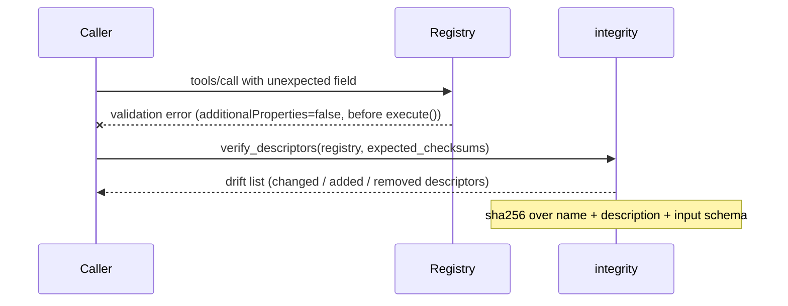
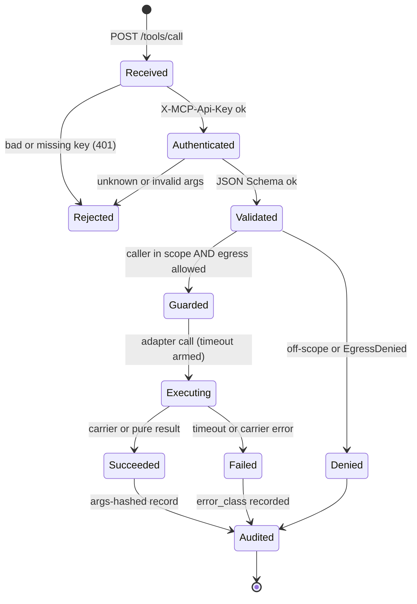
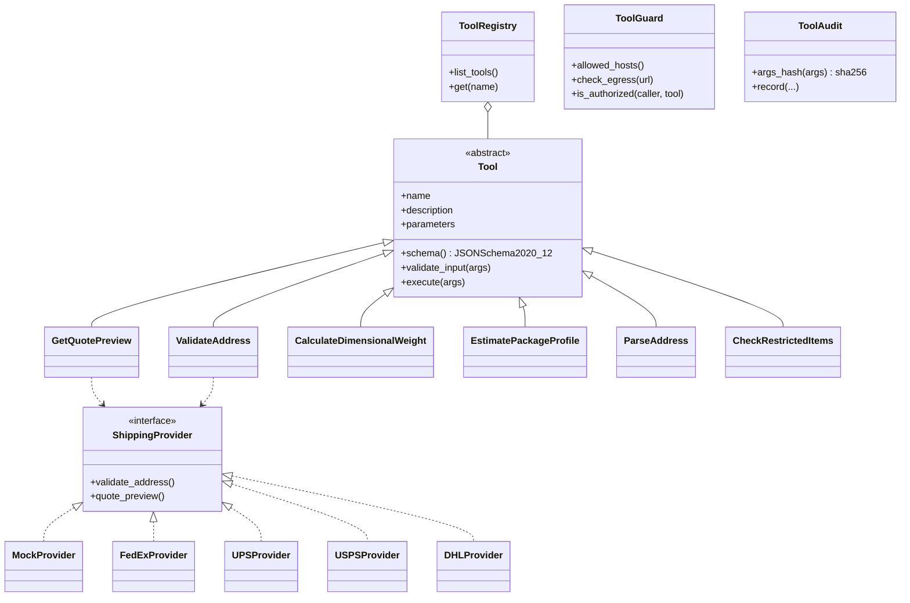
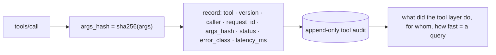
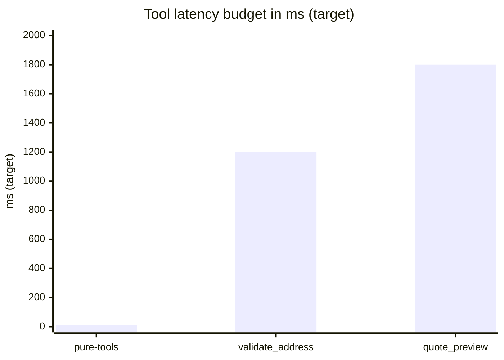
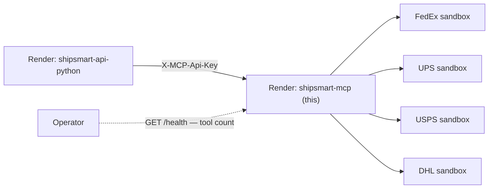

# ShipSmart — MCP Tool Server (`mcp`)

[](https://fastapi.tiangolo.com/)
[](https://www.python.org/)
[](https://docs.astral.sh/uv/)
[](https://modelcontextprotocol.io/)
[](#the-headline-invariant)
[](#tests)
[](https://shipsmart-mcp.onrender.com/health)
[](./LICENSE)

> The platform's **sandboxed tool boundary**: a standalone **Model Context
> Protocol** server exposing a *least-privilege, read-only, JSON-Schema-
> validated* tool registry. It is the only component that touches external
> carrier APIs — and by construction the place that can never write, book, or
> move money: **register a write tool and the service refuses to boot.**

Single source of truth for tool behavior across the platform:
[`ShipSmart-API`](https://github.com/nia194/ShipSmart-API) calls this server
over MCP/HTTP instead of implementing tools in-process.

**Stack:** FastAPI 0.135.3 · Python 3.13 (async) · uv · pydantic-settings ·
httpx · JSON Schema Draft 2020-12 · FedEx / UPS / USPS / DHL adapters (+ mock)

**Live:** [`GET /health`](https://shipsmart-mcp.onrender.com/health) (service +
registered tool count) · [`GET /`](https://shipsmart-mcp.onrender.com/)
discovery *(Render free tier — cold start ~30–60 s).*

> **Metric convention:** structural counts (tools, tests, endpoints) are facts
> verified against source; latency/availability figures are **(target)**
> budgets, never measured production metrics.

---

## Table of contents

- [The ShipSmart ecosystem](#the-shipsmart-ecosystem)
- [Architecture (HLD)](#architecture-hld)
- [The headline invariant](#the-headline-invariant)
- [HTTP contract](#http-contract)
- [Anatomy of a tool call](#anatomy-of-a-tool-call)
- [Tools](#tools)
- [Object design (OOD)](#object-design-ood)
- [Security layers & threat model](#security-layers--threat-model)
- [The audit trail](#the-audit-trail)
- [Performance & availability](#performance--availability)
- [Deployment topology](#deployment-topology)
- [Running locally](#running-locally)
- [Configuration](#configuration)
- [Tests](#tests)
- [License](#license)

---

## The ShipSmart ecosystem

One of six sibling repositories — clone them as siblings of this directory.
All six are also mirrored together in
**[ShipSmart](https://github.com/nia194/ShipSmart)** — the umbrella repository
that snapshots each component at a pinned commit (see its `COMPONENTS.yml`).

| Repo | Role | Stack |
|------|------|-------|
| [ShipSmart-Web](https://github.com/nia194/ShipSmart-Web) | React SPA — search-first UI | React 19, Vite, TS |
| [ShipSmart-Orchestrator](https://github.com/nia194/ShipSmart-Orchestrator) | Java system of record — single Postgres writer, AI trust boundary | Spring Boot 3.4, Java 17 |
| [ShipSmart-API](https://github.com/nia194/ShipSmart-API) | Python AI layer — RAG, guardrails, agents, streaming | FastAPI, Python 3.13 |
| **[ShipSmart-MCP](https://github.com/nia194/ShipSmart-MCP)** *(this repo)* | Read-only MCP tool server — 6 tools, 4+1 carrier adapters | FastAPI + MCP |
| [ShipSmart-Infra](https://github.com/nia194/ShipSmart-Infra) | Supabase schema, RLS, WORM ledger, edge functions | Supabase, Deno |
| [ShipSmart-Test](https://github.com/nia194/ShipSmart-Test) | Cross-repo contracts + evals + e2e | Python 3.13, pytest |

---

## Architecture (HLD)

**Figure 1 — container/component view.** Every call crosses the guard/audit/
integrity plane before any carrier adapter runs; the registry's JSON Schemas
power both discovery and enforcement.



**Patterns:** Adapter/Strategy (one `ShippingProvider` port, five adapters) ·
Registry (discovery + lookup) · least privilege as a **boot invariant** · Guard
(egress + caller scopes) · content-addressable integrity (descriptor checksums).

---

## The headline invariant

`READ_ONLY_TOOL_ALLOWLIST` is a **`frozenset`**, and `_enforce_read_only()`
runs at startup:

```
Refusing to start: non-read-only tool(s) registered: [...].
ShipSmart-MCP serves read/preview tools only; writes, bookings, and
money movement belong to the Java Orchestrator.
```

**Figure 2 — least privilege as a boot-time property.** A developer who
registers a write tool can't even start the service — the mistake fails loudly
in dev and CI, never silently in production.



---

## HTTP contract

| Endpoint | Purpose |
|---|---|
| `GET /` | discovery/info |
| `GET /health` | service + registered tool count |
| `POST /tools/list` | MCP discovery — full JSON Schemas per tool |
| `POST /tools/call` | execute one tool (auth + validation + guard + audit) |

`X-MCP-Api-Key` (shared key) gates the tool routes — this is an internal
service, called by the API, never by browsers.

---

## Anatomy of a tool call

**Figure 3 — `/tools/call` happy path: five controls in order.**



**Figure 4 — SSRF denial: blocked before any network I/O.** The same guard
denies any non-allowlisted host and every private/loopback/link-local IP
literal (the cloud metadata-endpoint attack).



**Figure 5 — schema rejection & descriptor drift: both fail closed.**



**Figure 6 — tool-call lifecycle (state machine).** Every terminal state —
success, failure, or denial — passes through the audit before the response
leaves.



---

## Tools

| Tool | Kind | Honest semantics |
|---|---|---|
| `validate_address` | carrier-backed | deliverability / normalization |
| `get_quote_preview` | carrier-backed | **preview** pricing — never bookable |
| `calculate_dimensional_weight` | pure | billable = max(actual, L·W·H ÷ divisor) |
| `estimate_package_profile` | pure | labelled profile → estimated dims, `is_estimate` flagged |
| `parse_address` | pure | freeform → components + rule-derived confidence; **reports missing parts, never guesses** |
| `check_restricted_items` | corpus-backed | allowed/warning/prohibited + source; **advisory-only — never asserts "cleared"** |

---

## Object design (OOD)

**Figure 7 — class model.** Tools depend on the provider **port**, never a
concrete carrier — adding a carrier is a new adapter; the tool layer is
untouched.



---

## Security layers & threat model

Five independent controls stack on every call:

1. **Shared-key auth** — `require_api_key` (`X-MCP-Api-Key`).
2. **SSRF egress allowlist** — allowlisted carrier hosts only;
   private/loopback/link-local IP literals denied before any I/O.
3. **Per-caller tool scopes** — off-scope tools are denied, not merely hidden.
4. **Descriptor integrity** — sha256 checksums make registry drift detectable.
5. **Append-only, args-hashed audit** — full observability, no PII store.

| Threat | Control |
|---|---|
| Unauthenticated access | shared-key `X-MCP-Api-Key` on tool routes |
| SSRF / metadata endpoint | egress allowlist + private-IP denial |
| Caller privilege creep | per-caller tool scopes |
| Poisoned tool descriptors (supply chain) | sha256 checksums + `verify_descriptors` |
| PII in audit | args-hash, never raw args |
| Write capability smuggled in | frozen allowlist + boot-time `RuntimeError` |

---

## The audit trail

**Figure 8 — one PII-safe record per call.** Raw arguments (which may carry
addresses) are never stored — only their hash, which still allows exact-call
correlation.



---

## Performance & availability

*(This service is stateless — it owns no database, so there is no
entity-relationship model here; the platform's ER story lives in
[ShipSmart-Infra](https://github.com/nia194/ShipSmart-Infra).)*

**Latency budget (target):**

| Tool | Validation | Carrier RTT | Total *(target)* |
|---|---|---|---|
| pure tools (×3) | ~2 ms | — | **< 10 ms** |
| validate_address | ~2 ms | 300–1500 ms | **< 2000 ms** |
| get_quote_preview | ~2 ms | 300–1800 ms | **< 2000 ms** |



**Availability & degradation (coded behaviors, facts):**

| Failure | Behavior |
|---|---|
| Carrier timeout | explicit httpx timeout → typed error, `error_class` audited |
| No carrier keys | MockProvider default — fully functional, keyless |
| Bad caller key | 401 at `require_api_key` — tools never execute |
| Off-scope caller | denied by `tool_guard` scopes |

Availability **99.5% (target)**; probes: `GET /health` (the tool count doubles
as a registry-drift canary) and `GET /` discovery.

---

## Deployment topology

**Figure 9 — production layout.** Called only by the API; `/docs` off in prod;
sandbox carrier base URLs by default.



---

## Running locally

```bash
uv sync
uv run uvicorn app.main:app --reload --host 0.0.0.0 --port 8001
curl localhost:8001/health        # {"service":"shipsmart-mcp","tools":N}
```

Keyless by default (`SHIPPING_PROVIDER=mock`). Set carrier credentials via env
to hit sandboxes.

## Configuration

| Env | Effect |
|---|---|
| `MCP_API_KEY` | shared key for `/tools/*` (empty ⇒ open, dev only) |
| `SHIPPING_PROVIDER` | `mock` (default) · `fedex` · `ups` · `usps` · `dhl` |
| carrier `*_CLIENT_ID` / `*_SECRET` / base URLs | sandbox-by-default adapters |

## Tests

```bash
uv run pytest        # 94 tests — keyless (mock provider), fast
uv run ruff check .
```

The API↔MCP tool-policy contract is additionally asserted by
**ShipSmart-Test** in CI.

## License

See [LICENSE](./LICENSE).
