# ShipSmart — Orchestrator (Java / Spring Boot API)

[](https://spring.io/projects/spring-boot)
[](https://openjdk.org/projects/jdk/17/)
[](https://gradle.org/)
[](https://flywaydb.org/)
[](#security)
[](#tests)
[](https://shipsmart.onrender.com/api/v1/health)
[](./LICENSE)

> The **system of record** of the ShipSmart platform — and the reason its AI
> can't lie. Owns quotes, bookings, saved options, shipments, and tracking
> behind **JWKS-verified authentication**, optimistic locking, idempotency, and
> **`AiClaimGuard`**: every AI-assisted booking is re-derived from stored state,
> and **Java wins on price.** The model advises; this service decides.

**Single writer to Supabase Postgres** — every other service reads through this
one. Where the FastAPI sibling is probabilistic and stateless, this service is
deterministic and stateful.

**Stack:** Spring Boot 3.4.4 · Java 17 · Gradle 8.12 · Spring Data JPA ·
PostgreSQL · Flyway (validate) · Caffeine · Bucket4j · Spring Security ·
Spring AOP · Micrometer → OpenTelemetry (OTLP) + Prometheus · SpringDoc ·
Testcontainers

**Live:** [`GET /api/v1/health`](https://shipsmart.onrender.com/api/v1/health) ·
[`GET /actuator/health`](https://shipsmart.onrender.com/actuator/health)
*(Swagger is deliberately 401 in production; Render free tier cold-starts
~30–60 s).*

> **Metric convention:** structural counts/configs are facts (111 tests, rate
> limits 20/30/10 per min, Caffeine `max 5000 / 120s`); latency figures are
> **(target)** budgets, never measured production metrics.

---

## Table of contents

- [The ShipSmart ecosystem](#the-shipsmart-ecosystem)
- [Architecture (HLD)](#architecture-hld)
- [Request flow](#request-flow)
- [The trust boundary: AiClaimGuard](#the-trust-boundary-aiclaimguard)
- [Scatter-gather quoting](#scatter-gather-quoting)
- [Concurrency & idempotency](#concurrency--idempotency)
- [Object design (OOD)](#object-design-ood)
- [Data model (ER)](#data-model-er)
- [Caching](#caching)
- [Security](#security)
- [Performance & availability](#performance--availability)
- [Deployment topology](#deployment-topology)
- [Running locally](#running-locally)
- [Configuration reference](#configuration-reference)
- [Tests](#tests)
- [License](#license)

---

## The ShipSmart ecosystem

One of six sibling repositories — clone them as siblings of this directory. All
six are also mirrored together in
**[ShipSmart](https://github.com/nia194/ShipSmart)** — the umbrella repository
that snapshots each component at a pinned commit (see its `COMPONENTS.yml`).

| Repo | Role | Stack |
|------|------|-------|
| [ShipSmart-Web](https://github.com/nia194/ShipSmart-Web) | React SPA — search-first UI | React 19, Vite, TS |
| **[ShipSmart-Orchestrator](https://github.com/nia194/ShipSmart-Orchestrator)** *(this repo)* | Java system of record — single Postgres writer, AI trust boundary | Spring Boot 3.4, Java 17 |
| [ShipSmart-API](https://github.com/nia194/ShipSmart-API) | Python AI layer — RAG, guardrails, agents, SSE streaming | FastAPI, Python 3.13 |
| [ShipSmart-MCP](https://github.com/nia194/ShipSmart-MCP) | Read-only MCP tool server | FastAPI + MCP |
| [ShipSmart-Infra](https://github.com/nia194/ShipSmart-Infra) | Supabase schema, RLS, WORM ledger, edge functions | Supabase, Deno |
| [ShipSmart-Test](https://github.com/nia194/ShipSmart-Test) | Cross-repo contracts + evals + e2e | Python 3.13, pytest |

---

## Architecture (HLD)

**Figure 1 — container/component view.** Every mutating path crosses auth,
rate limiting, idempotency, and ownership checks before a service runs;
auditing is aspect-driven so it cannot be forgotten on new endpoints.

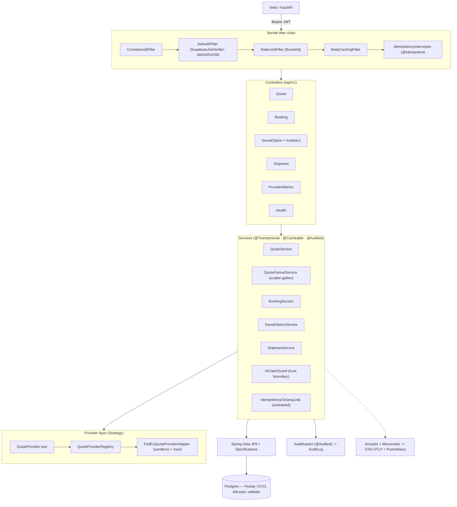

---

## Request flow

**Figure 2 — ingress to response, with every gate annotated.**

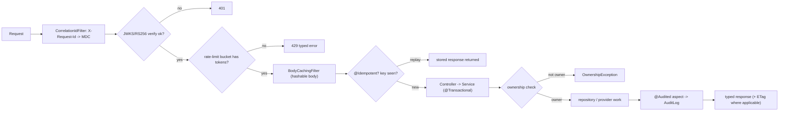

---

## The trust boundary: AiClaimGuard

**Figure 3 — an AI-assisted booking, re-derived from stored state.**

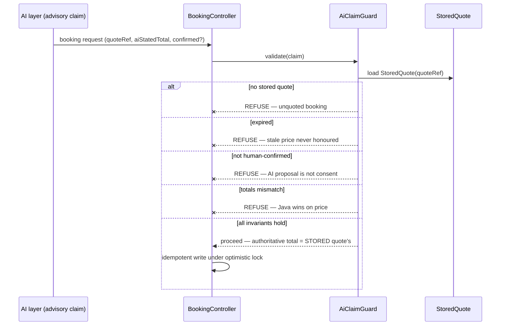

**Figure 4 — the decision tree: each failed invariant is a distinct, auditable
refusal.**

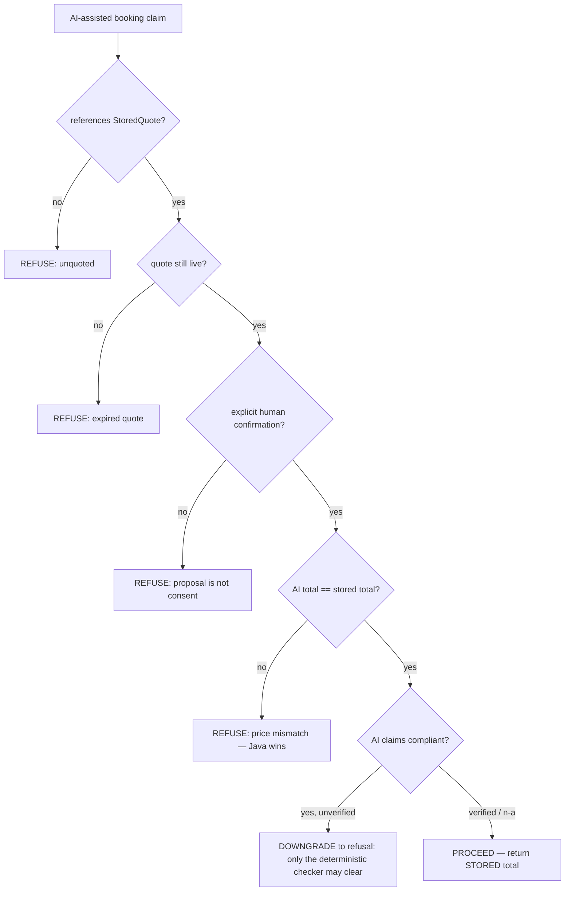

Pure and deterministic (injected `Clock`), exhaustively unit-tested.

---

## Scatter-gather quoting

**Figure 5 — parallel carriers; total latency ≈ slowest, not sum.** Failures
surface as **`QuoteTrust`-tagged partials**, never silent gaps.

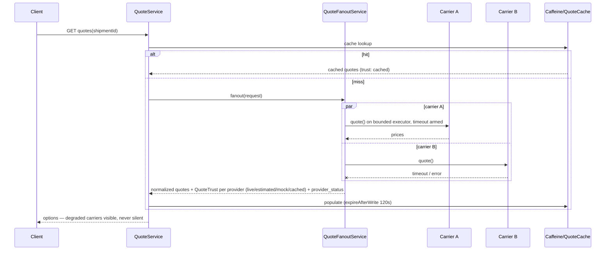

---

## Concurrency & idempotency

**Figure 6 — optimistic locking: `@Version` + ETag.**

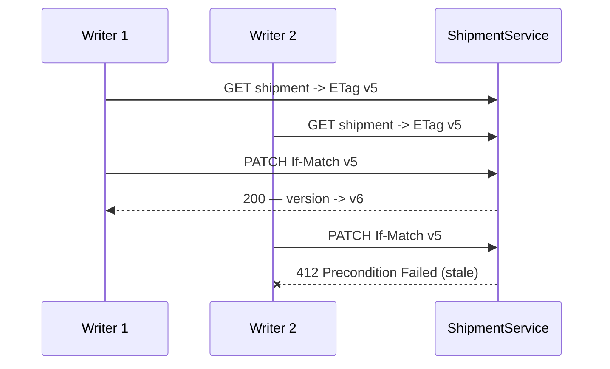

**Figure 7 — idempotent retry: replay-safe writes.**

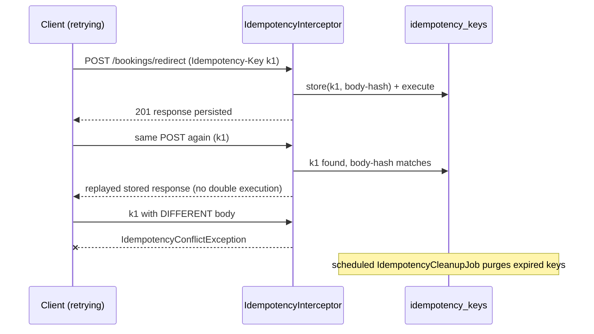

---

## Object design (OOD)

**Figure 8 — provider seam, record DTOs, exception taxonomy.** DTOs are
immutable `record`s; entities inherit `@Version` from `BaseEntity`; JPA
**Specifications** compose type-safe filtered queries instead of string JPQL.

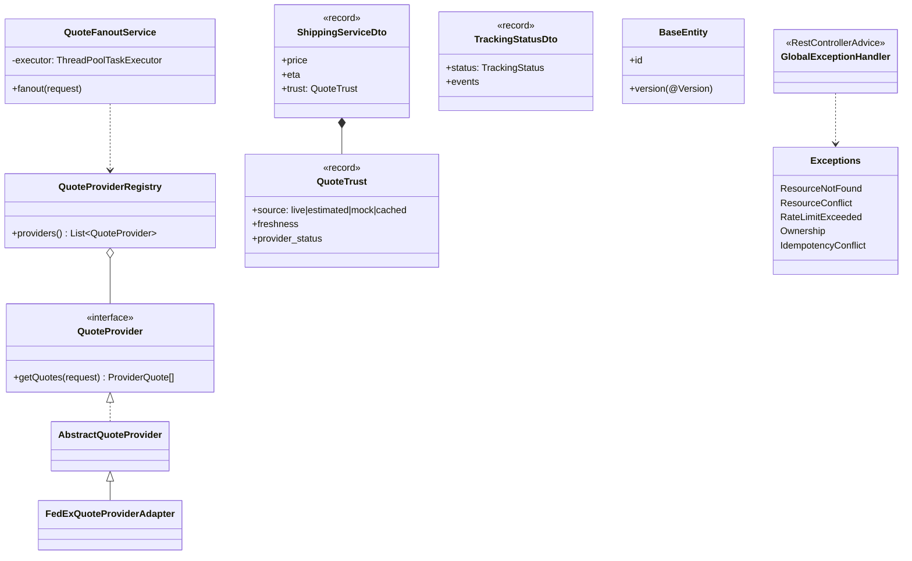

---

## Data model (ER)

**Figure 9 — persisted entities (key fields).** Flyway owns this schema
(`V1__baseline`, `V2__interview_upgrade`); Hibernate runs `ddl-auto: validate`
plus a `FlywayValidationRunner`, so drift fails startup. *(Field lists are
representative — the migrations are authoritative.)*

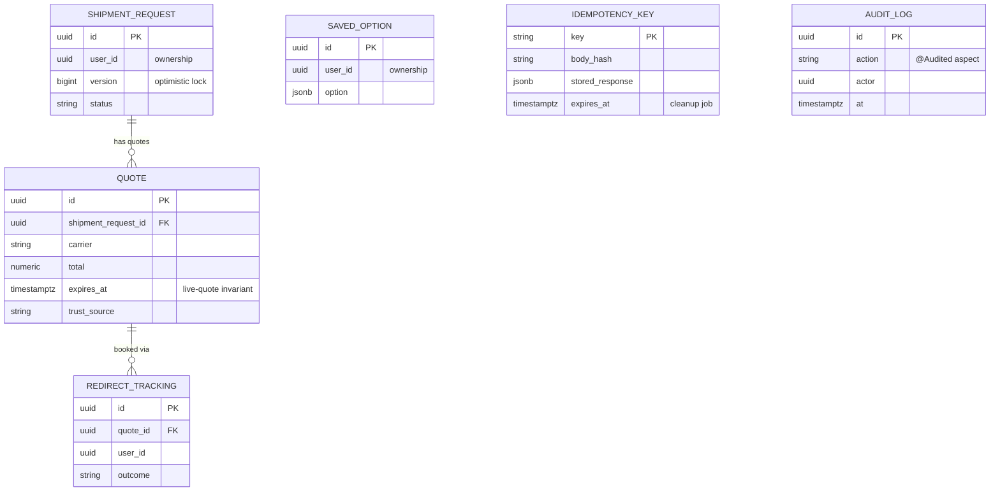

---

## Caching

**Figure 10 — two-tier cache + the trust taxonomy.**

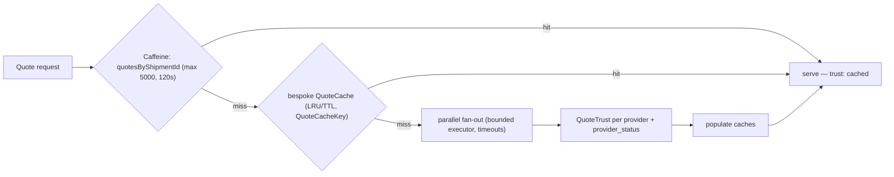

---

## Security

- **JWKS/RS256** primary verification (`SupabaseJwtVerifier`); HS256 only as
  legacy/test fallback; Spring Security per-route rules; CSRF off (stateless
  bearer API) with configured CORS.
- **Prod fail-closed:** `require-jwt-secret: true`; error responses carry no
  stacktraces/messages; actuator limited to
  `health,info,metrics,caches,prometheus`; **Swagger 401 in prod**.
- **Row-ownership authorization** (`OwnershipException`) on every user-scoped
  entity — object-level access control, not just authentication.

| Threat | Control |
|---|---|
| Forged identity | JWKS/RS256 verification |
| Cross-user data access | ownership checks per entity |
| Replayed/double writes | idempotency keys + body hash |
| Brute-force / abuse | Bucket4j buckets (20/30/10 per min) |
| Info leakage via errors | prod stacktraces/messages `never`; Swagger 401 |
| AI-invented price/clearance | AiClaimGuard invariants (Fig. 3–4) |

---

## Performance & availability

**Latency budget (target):**

| Path | Budget *(target)* |
|---|---|
| Cache hit | < 30 ms |
| Single-carrier quote | < 1.5 s |
| Full fan-out (parallel) | ≈ slowest carrier, < 2 s |
| Booking validation (AiClaimGuard) | < 50 ms |

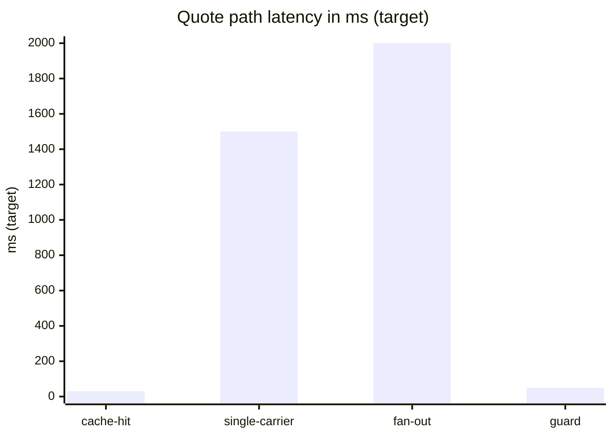

**Degradation matrix (coded behaviors, facts):**

| Failure | Behavior |
|---|---|
| One carrier down/slow | per-call timeout → trust-tagged partial results |
| Stale concurrent write | HTTP 412 via ETag/@Version |
| Duplicate write retry | idempotent replay; payload mismatch → conflict |
| Schema drift | startup fails (validate mode + FlywayValidationRunner) |
| Missing JWT secret (prod) | boot refuses (`require-jwt-secret: true`) |

---

## Deployment topology

**Figure 11 — production layout.**

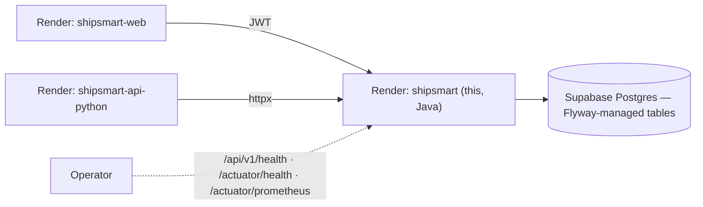

Profiles: `application-local.yml` vs `application-production.yml` — prod
requires the JWT secret, suppresses stacktraces, keeps actuator exposure
minimal.

---

## Running locally

```bash
./gradlew bootRun          # http://localhost:8080 (local profile)
./gradlew test             # 111 tests (Testcontainers suites need Docker)
./gradlew clean bootJar    # production jar
```

Gradle 8.12 via the wrapper — no host install required. JDK 17 toolchain.

## Configuration reference

| Env | Effect |
|---|---|
| `SUPABASE_JWT_SECRET` / `REQUIRE_JWT_SECRET` | JWT verification; prod fail-closed |
| `SHIPSMART_RATE_LIMIT_ENABLED` / `_SHIPMENTS` / `_QUOTES` / `_BOOKINGS` | Bucket4j limits (defaults 20/30/10 per min) |
| `SHIPSMART_IDEMPOTENCY_ENABLED` | idempotency keys on the write endpoints |
| `spring.cache.caffeine.spec` | `maximumSize=5000,expireAfterWrite=120s` |

## Tests

**111 `@Test` across 21 classes** — JUnit 5 + AssertJ unit tests with injected
`Clock`, plus **Testcontainers** integration tests against real ephemeral
Postgres. **Spotless** (google-java-format) is wired into `check`/`build`.
Cross-repo: the §5.6 trust boundary and DTO wire shapes are asserted by
**ShipSmart-Test** in CI.

## License

See [LICENSE](./LICENSE).
