# ShipSmart — Web Frontend (`web`)

[](https://react.dev/)
[](https://www.typescriptlang.org/)
[](https://vitejs.dev/)
[](https://tailwindcss.com/)
[](#streaming--perceived-speed)
[-3FB950?logo=vitest&logoColor=white)](#tests--quality-gates)
[](https://shipsmart-web.onrender.com)
[](./LICENSE)

> The **search-first** UI of the ShipSmart platform: a KAYAK-style quote grid
> with an AI copilot that *drives the search* — by rendering **typed product
> instructions** (never parsed prose), applying **policy-gated, undoable form
> patches**, and streaming answers over **Server-Sent Events**. The assistant
> can never fabricate a price or silently mutate the form.

**[▶ Live demo](https://shipsmart-web.onrender.com)** — *hosted on Render's
free tier; first load may take ~30–60 s to wake.*

Talks to two backends: the Java system of record
([ShipSmart-Orchestrator](https://github.com/nia194/ShipSmart-Orchestrator))
and the Python AI layer
([ShipSmart-API](https://github.com/nia194/ShipSmart-API)).

**Stack:** React 19 · TypeScript 5.9 (`strict`) · Vite 5 · Tailwind + shadcn/ui
· Radix UI · TanStack Query 5 · React Router · Supabase JS

> **Metric convention:** structural counts are facts (87 tests, 12 flags,
> 0 `as any`/`eval`/`innerHTML`); latency/bundle figures are **(target)**.

---

## Table of contents

- [The ShipSmart ecosystem](#the-shipsmart-ecosystem)
- [Architecture (HLD)](#architecture-hld)
- [Component tree](#component-tree)
- [The typed assistant contract](#the-typed-assistant-contract)
- [Safe, undoable form mutation](#safe-undoable-form-mutation)
- [Streaming & perceived speed](#streaming--perceived-speed)
- [State management](#state-management)
- [Module design (LLD)](#module-design-lld)
- [Performance, safety & degradation](#performance-safety--degradation)
- [Deployment topology](#deployment-topology)
- [Running locally](#running-locally)
- [Available scripts](#available-scripts)
- [Configuration (feature flags)](#configuration-feature-flags)
- [Tests & quality gates](#tests--quality-gates)
- [License](#license)

---

## The ShipSmart ecosystem

One of six sibling repositories — clone them as siblings of this directory. All
six are also mirrored together in
**[ShipSmart](https://github.com/nia194/ShipSmart)** — the umbrella repository
that snapshots each component at a pinned commit (see its `COMPONENTS.yml`).

| Repo | Role | Stack |
|---|---|---|
| **[ShipSmart-Web](https://github.com/nia194/ShipSmart-Web)** *(this repo)* | React SPA — search-first UI, typed AI rendering | React 19, Vite, TS |
| [ShipSmart-Orchestrator](https://github.com/nia194/ShipSmart-Orchestrator) | Java system of record — single Postgres writer, AI trust boundary | Spring Boot 3.4, Java 17 |
| [ShipSmart-API](https://github.com/nia194/ShipSmart-API) | Python AI layer — RAG, guardrails, agents, SSE | FastAPI, Python 3.13 |
| [ShipSmart-MCP](https://github.com/nia194/ShipSmart-MCP) | Read-only MCP tool server | FastAPI + MCP |
| [ShipSmart-Infra](https://github.com/nia194/ShipSmart-Infra) | Supabase schema, RLS, WORM ledger, edge functions | Supabase, Deno |
| [ShipSmart-Test](https://github.com/nia194/ShipSmart-Test) | Cross-repo contracts + evals + e2e | Python 3.13, pytest |

---

## Architecture (HLD)

**Figure 1 — app composition.** Everything the copilot can do flows through
three framework-free modules — `typed-outputs` (what it may say), `ai-trust`
(what may apply), `grid-actions` (what the grid may do) — the most heavily
unit-tested seams in the app.

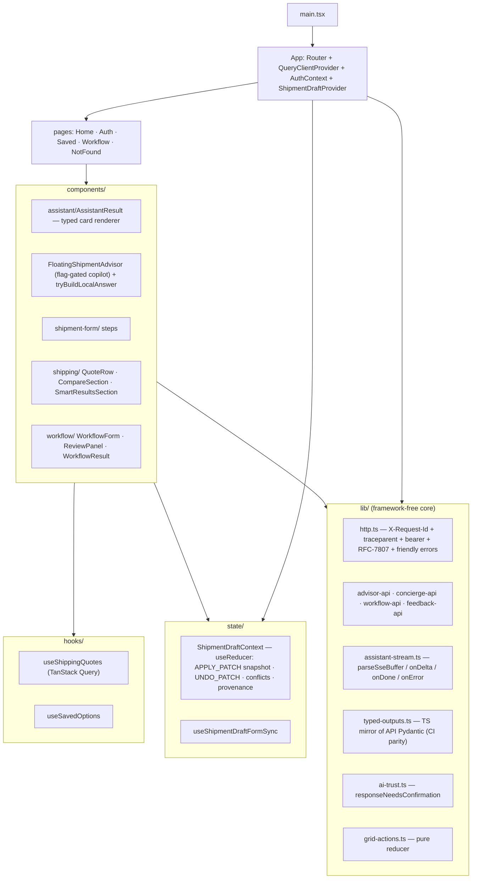

---

## Component tree

**Figure 2 — key components: state owners vs consumers, and which flag gates
which surface.**

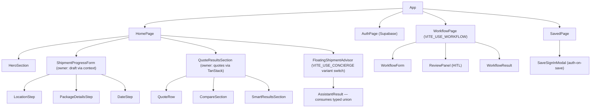

---

## The typed assistant contract

**Figure 3 — types render; the prose parser is bypassed.**

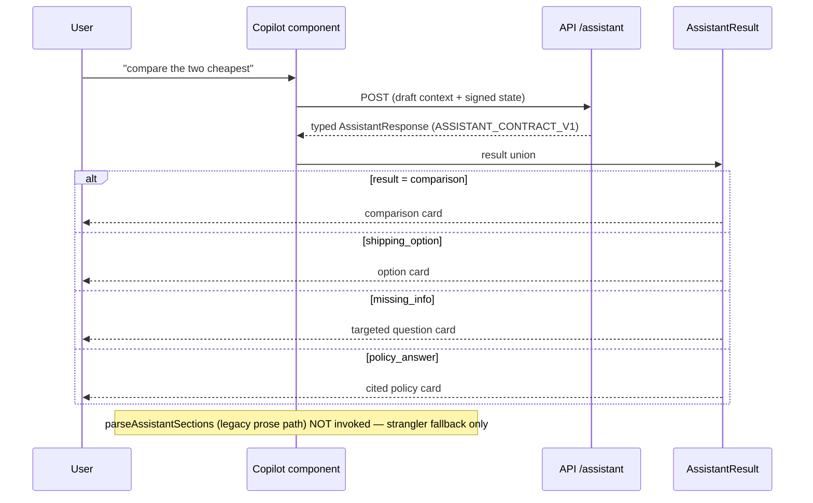

**Figure 4 — the render-path decision (the strangler in one diagram).**

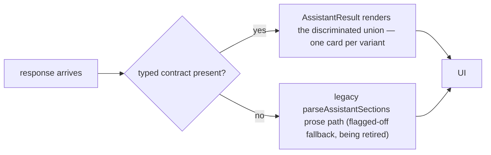

`lib/typed-outputs.ts` mirrors the API's Pydantic models **field-for-field**
and is **parity-tested in CI** by ShipSmart-Test — a rename on either side
fails the build, not a user session.

---

## Safe, undoable form mutation

**Figure 5 — auto / confirm / never, with snapshot Undo.** A price the model
*typed* is never authoritative without a quote reference; Undo can only ever
reverse the assistant, never the user.

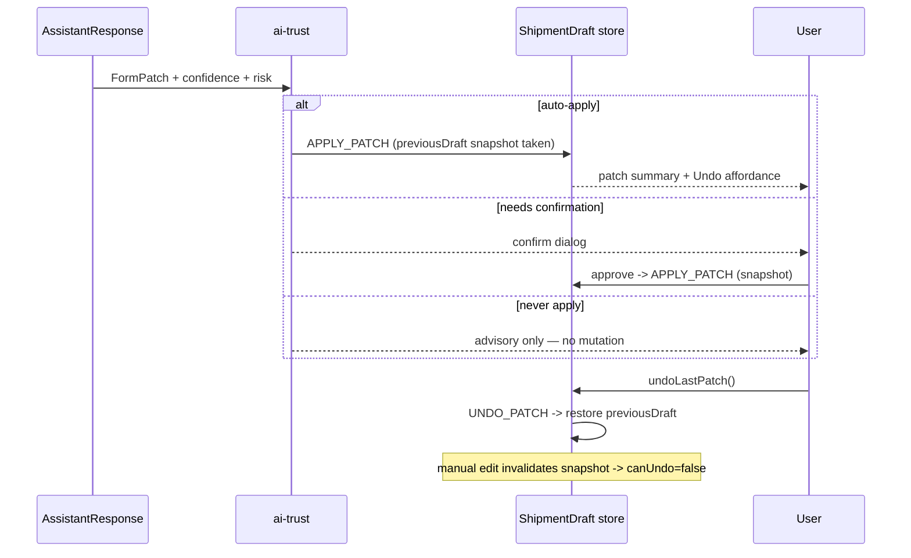

---

## Streaming & perceived speed

**Figure 6 — three layers stack: instant local answer → progressive deltas →
typed envelope.** Transport failures degrade to `onError`; the client never
throws.

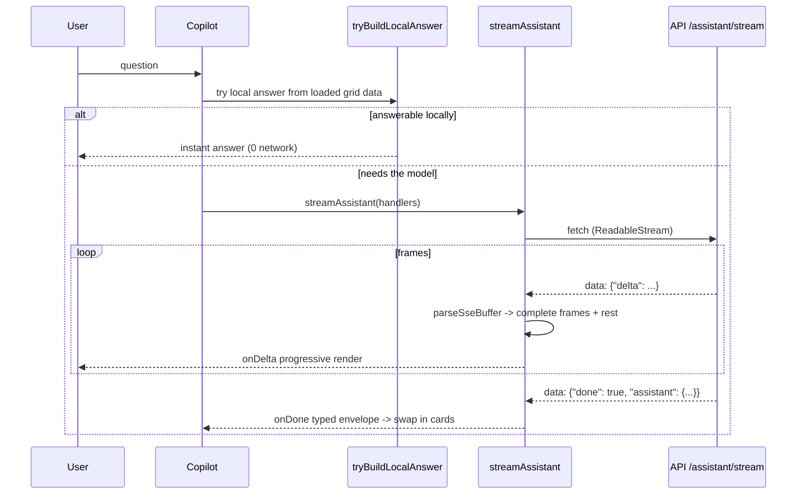

---

## State management

**Figure 7 — the draft store lifecycle (state machine).**

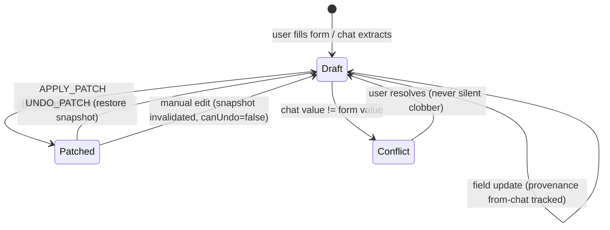

**Figure 8 — auth exactly when needed.**

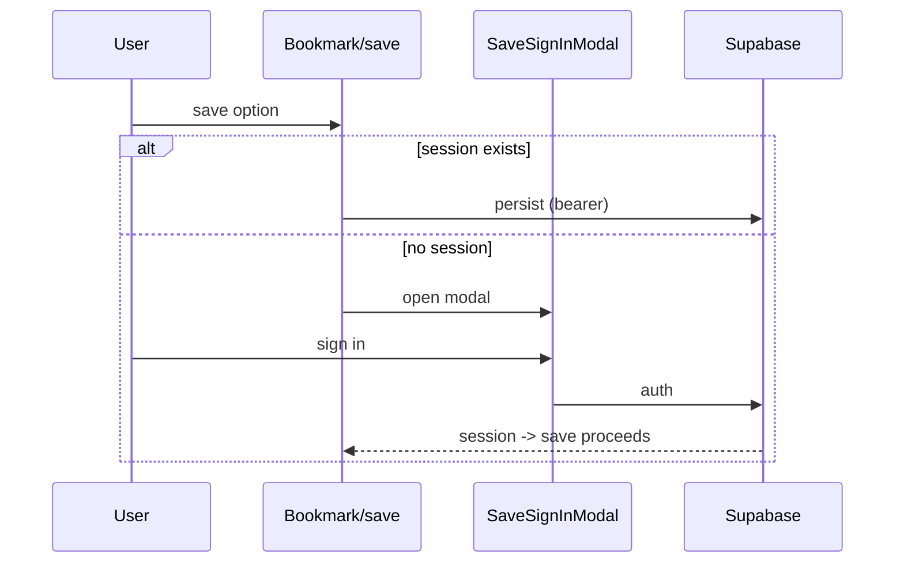

---

## Module design (LLD)

**Figure 9 — the `lib/` seams.** `typed-outputs` is the single source the
other seams import — and the file the cross-repo parity test locks against the
API.

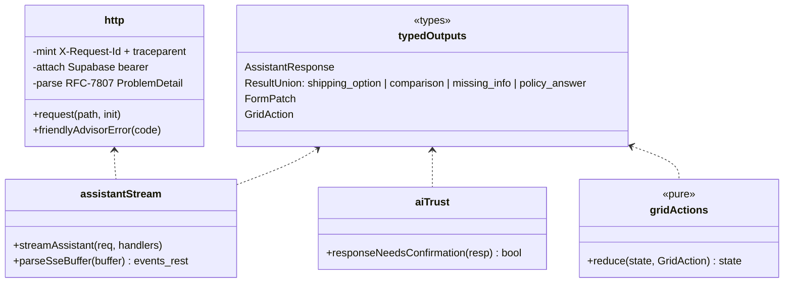

---

## Performance, safety & degradation

**Perceived-speed budget (target):**

| Milestone | Budget *(target)* |
|---|---|
| Local answer (grid data) | < 50 ms |
| First streamed token | < 1 s |
| Typed envelope (done) | < 3 s |
| Route TTI (warm) | < 2 s |

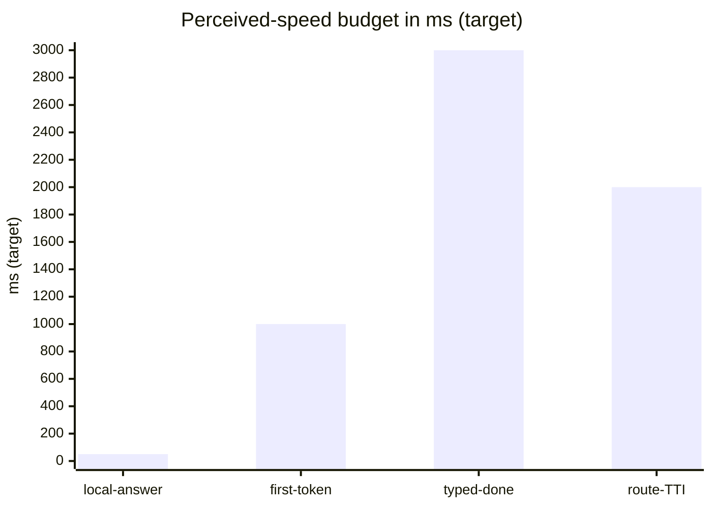

*Honest caveat (fact):* Render free tier cold-starts the backend ~30–60 s on
first hit; the UI communicates rather than hides it. Vendor code is split into
long-lived chunks (`react-vendor` / `supabase` / `query`).

**Safety & hygiene (facts):** `strict` TS + `noUnusedLocals`/`Parameters`;
**0** `as any` · **0** `dangerouslySetInnerHTML` · **0** `eval`
(grep-verified); ESLint 9 flat config.

| Threat | Control |
|---|---|
| Malicious model output → DOM | typed rendering; zero `innerHTML`/`eval` |
| Silent form manipulation | apply-policy + confirm + undo + provenance |
| Fabricated price display | prices render from grid/quote data, not prose |
| Token mishandling | single auth-aware `http` wrapper |

**Degradation matrix (coded behaviors):**

| Condition | Behavior |
|---|---|
| `VITE_USE_CONCIERGE` off | advisor variant renders; concierge surface absent |
| `VITE_USE_WORKFLOW` off | workflow page/feature hidden |
| Java cutover flags off | legacy quote/saved/booking paths used (strangler) |
| SSE transport failure | `onError` fallback — non-streamed answer path |
| Typed contract absent | legacy prose parser fallback |

---

## Deployment topology

**Figure 10 — production layout.** 12 `VITE_*` flags make every integration a
dial: capability rollout, strangler cutovers, market scope.

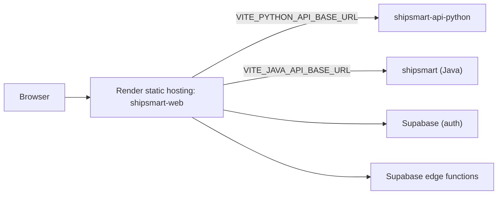

---

## Running locally

```bash
npx -y pnpm@9 install
npx -y pnpm@9 dev          # http://localhost:5173
```

Point `VITE_PYTHON_API_BASE_URL` / `VITE_JAVA_API_BASE_URL` at local siblings
(ports 8000 / 8080) or the live services.

## Available scripts

| Script | What |
|---|---|
| `pnpm dev` | Vite dev server (:5173) |
| `pnpm build` / `pnpm preview` | production build / local preview |
| `pnpm typecheck` | `tsc -b --noEmit` |
| `pnpm lint` | ESLint 9 (flat config) |
| `pnpm test` / `pnpm test:watch` | Vitest |

## Configuration (feature flags)

| `VITE_*` | Effect |
|---|---|
| `VITE_USE_CONCIERGE` / `VITE_USE_WORKFLOW` | copilot + workflow surfaces |
| `VITE_USE_JAVA_QUOTES` / `VITE_USE_JAVA_SAVED_OPTIONS` / `VITE_USE_JAVA_BOOKING_REDIRECT` | strangler cutovers to the Java backend |
| `VITE_SHIPPING_SCOPE` / `VITE_DOMESTIC_COUNTRY` | market scope |
| `VITE_PYTHON_API_BASE_URL` / `VITE_JAVA_API_BASE_URL` | backend bases |
| `VITE_SUPABASE_URL` / `VITE_SUPABASE_ANON_KEY` / `VITE_APP_ENV` | platform wiring |

## Tests & quality gates

**87 Vitest tests across 22 files** — libs (http, typed-outputs, ai-trust,
grid-actions, SSE parsing), state (draft / undo / conflicts), hooks, and typed
card rendering. Three distinct CI gates: `tsc -b --noEmit`, ESLint, Vitest.
Cross-repo: the typed contract is parity-locked by **ShipSmart-Test**.

## License

See [LICENSE](./LICENSE).
